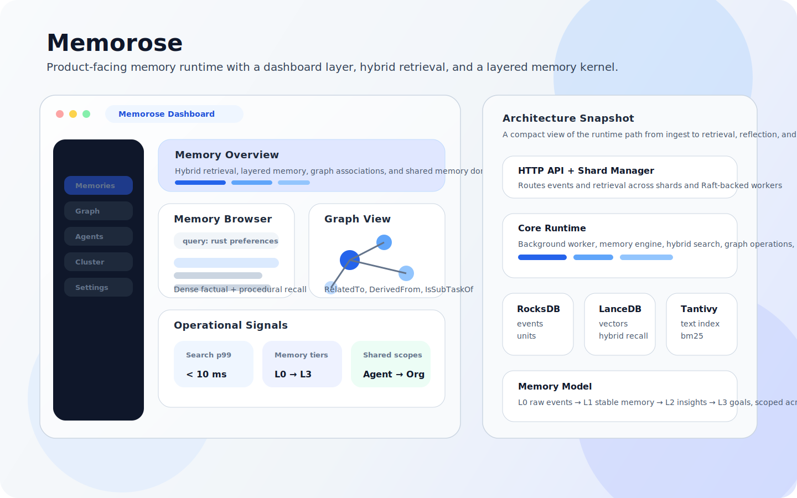
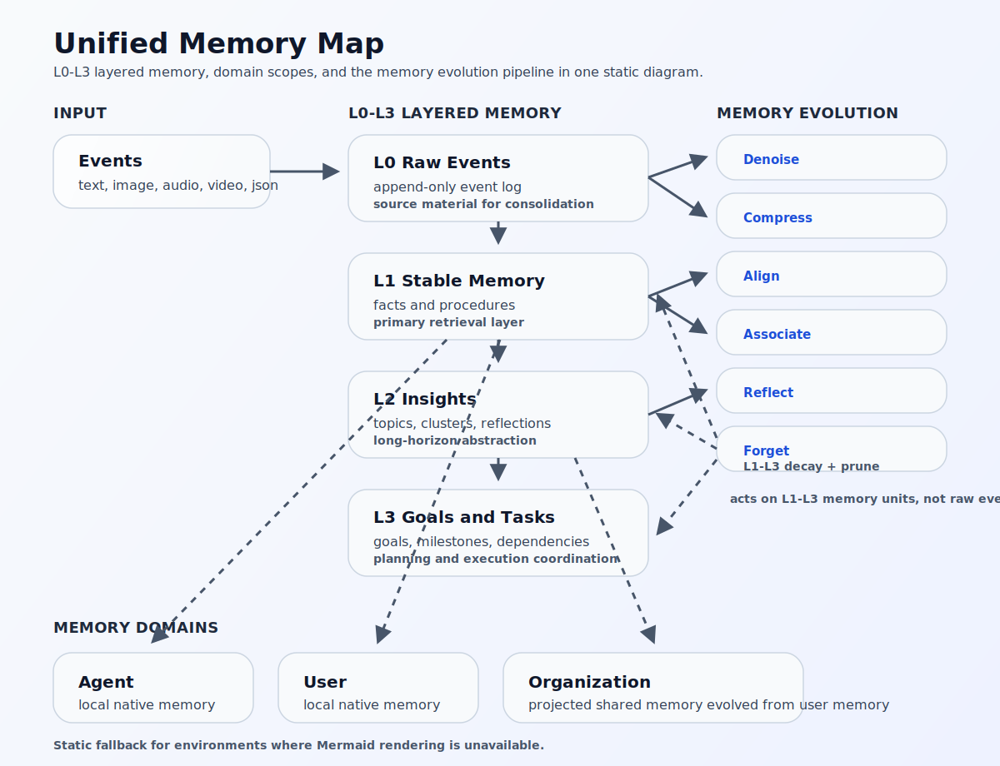
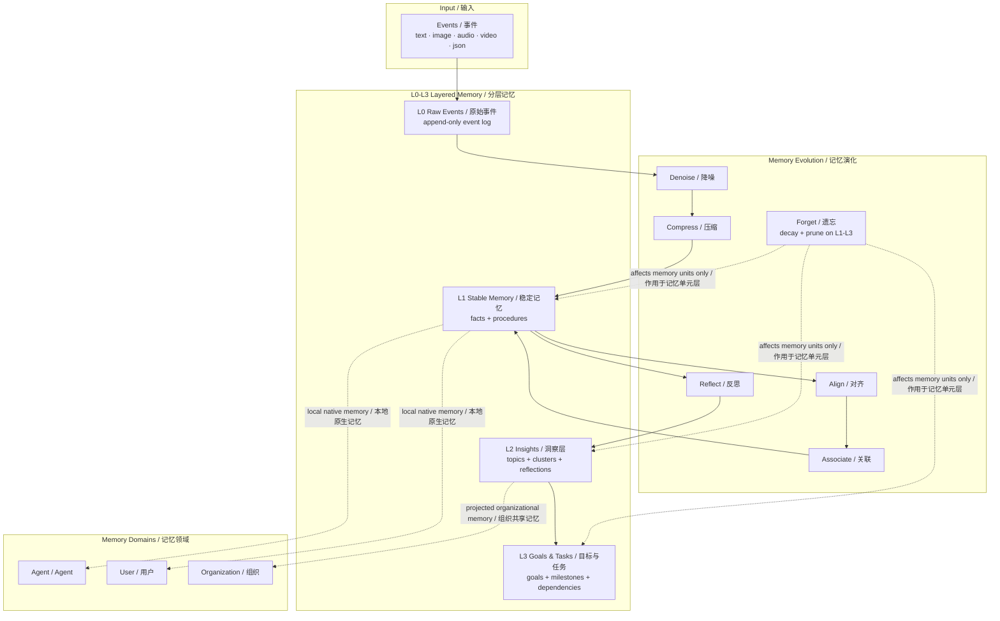

<div align="center">
  <br />
  <a href="https://memorose.io">
    
  </a>
  <h1>Memorose</h1>
  <p><b>面向 AI Agent 的开源记忆运行时。</b></p>
  <p>把持久记忆、过程记忆、共享知识与遗忘机制放进一个 Rust 原生栈里。</p>
  <p>
    <a href="./README.md"><b>English</b></a>
  </p>
  <br />
  <p>
    <a href="https://memorose.io/docs"><b>文档</b></a> &nbsp;&bull;&nbsp;
    <a href="https://memorose.io"><b>官网</b></a> &nbsp;&bull;&nbsp;
    <a href="https://github.com/ai-akashic/Memorose/issues"><b>Issues</b></a> &nbsp;&bull;&nbsp;
    <a href="https://discord.gg/memorose"><b>Discord</b></a>
  </p>
  <p>
    <a href="https://github.com/ai-akashic/Memorose/stargazers"></a>
    <a href="https://github.com/ai-akashic/Memorose/releases"></a>
    <a href="https://github.com/ai-akashic/Memorose/blob/main/LICENSE"></a>
    
    <a href="https://github.com/ai-akashic/Memorose/commits/main"></a>
  </p>
  <br />
</div>

<p align="center">
  
</p>
<p align="center"><sub>Memorose 不是向量库外面再包一层接口，而是一套面向 Agent 的记忆运行时：写入、固化、检索、反思、共享、遗忘在一个系统里完成。</sub></p>

---

## 为什么是 Memorose

很多 Agent 项目所谓的“记忆”，本质上还是给向量库换了一个更好听的名字。

真正可用的 Agent 记忆系统，必须同时支持事实记忆、过程记忆、跨时间演化，以及 agent、user、organization 多层作用域边界。

Memorose 就是为这个目标设计的：一套可自托管的 Rust 记忆运行时，把写入、固化、检索、反思、共享、遗忘放进同一个系统里。

**Memorose** 试图把这些能力做成一个真正的记忆运行时：

- **分层记忆**：从原始事件到稳定记忆、洞察、目标
- **事实记忆 + 过程记忆**：而不是仅仅保存文本片段
- **领域感知记忆**：覆盖 agent、user、organization 三层作用域
- **混合检索**：向量、全文、图扩展、重排协同工作
- **持续演化**：降噪、压缩、关联、反思、遗忘形成完整生命周期
- **多模态输入**：支持文本、图像、音频、视频
- **Rust 原生部署**：嵌入式存储，无 Python 依赖链

一个二进制，自托管，目标亚 10ms 检索延迟。给真正需要记忆系统的 Agent 用。

## 为什么值得 Star

- **不是向量库封装。** 它有真正的记忆模型，包含分层、分域、演化和遗忘。
- **按基础设施来构建。** Rust、嵌入式存储、分片、Raft、Dashboard 一套打通。
- **差异化落在关键处。** 混合检索、图记忆、多模态输入、共享作用域放在同一栈里。
- **心智模型足够清晰。** `L0-L3` 加上 `Agent/User/Organization`，开发者容易讲清，也容易扩展。

## Highlights

<table>
  <tr>
    <td valign="top" width="25%">
      <strong>分层记忆</strong><br />
      原始事件通过清晰的 L0-L3 流水线演化为稳定记忆、洞察与目标。
    </td>
    <td valign="top" width="25%">
      <strong>作用域清晰</strong><br />
      记忆先在 agent、user、organization 各层隔离形成，再按策略向上共享。
    </td>
    <td valign="top" width="25%">
      <strong>事实 + 过程</strong><br />
      既记住发生了什么，也记住工作是怎么完成的。
    </td>
    <td valign="top" width="25%">
      <strong>混合检索</strong><br />
      向量、全文、图扩展和重排在同一栈里协同工作。
    </td>
  </tr>
  <tr>
    <td valign="top" width="25%">
      <strong>记忆演化</strong><br />
      降噪、压缩、对齐、关联、反思、遗忘都是运行时内建能力。
    </td>
    <td valign="top" width="25%">
      <strong>原生多模态</strong><br />
      文本、图像、音频、视频进入同一套记忆系统。
    </td>
    <td valign="top" width="25%">
      <strong>Rust 原生栈</strong><br />
      嵌入式存储、自托管简单、整体架构面向生产。
    </td>
    <td valign="top" width="25%">
      <strong>为 Agent 而建</strong><br />
      面向 copilot、自治 agent、支持系统与多租户 AI 产品。
    </td>
  </tr>
</table>

---

<details>
<summary><b>目录</b></summary>

- [为什么是 Memorose](#为什么是-memorose)
- [为什么值得 Star](#为什么值得-star)
- [快速开始](#快速开始)
- [你可以用它做什么](#你可以用它做什么)
- [它是如何工作的](#它是如何工作的)
- [多维记忆模型](#多维记忆模型)
- [记忆领域](#记忆领域)
- [领域边界](#领域边界)
- [六种认知操作](#六种认知操作)
- [原生多模态嵌入](#原生多模态嵌入)
- [功能对比](#功能对比)
- [性能](#性能)
- [架构](#架构)
- [Dashboard](#dashboard)
- [配置](#配置)
- [API Reference / API 参考](#api-reference--api-参考)
- [Roadmap](#roadmap)
- [贡献](#贡献)
- [许可证](#许可证)

</details>

---

## 快速开始

<table>
  <tr>
    <td valign="top" width="33%">
      <strong>Step 1. 启动 Memorose</strong><br />
      可以直接用 Docker，也可以从源码构建完整本地环境。
      <pre lang="bash"><code>docker run -d -p 3000:3000 \
  -e GOOGLE_API_KEY=your_key \
  -e MEMOROSE__LLM__MODEL=gemini-2.0-flash \
  -e MEMOROSE__LLM__EMBEDDING_MODEL=gemini-embedding-2-preview \
  akashic/memorose:latest</code></pre>
      <details>
        <summary><b>从源码构建</b></summary>
        <pre lang="bash"><code>git clone https://github.com/ai-akashic/Memorose.git
cd Memorose
cargo build --release
./target/release/memorose-server</code></pre>
      </details>
    </td>
    <td valign="top" width="33%">
      <strong>Step 2. 写入一个事件</strong><br />
      把一次交互、观察结果或工具输出写入记忆运行时。
      <pre lang="bash"><code>export STREAM=$(uuidgen)

curl -s -X POST http://localhost:3000/v1/users/dylan/streams/$STREAM/events \
  -H "Content-Type: application/json" \
  -d '{"content": "我更喜欢 Rust，不喜欢无效会议，我的狗叫 Rosie。"}'</code></pre>
    </td>
    <td valign="top" width="33%">
      <strong>Step 3. 带着记忆检索</strong><br />
      发起一个新查询，让 Agent 回忆稳定记忆，而不是只依赖当前上下文窗口。
      <pre lang="bash"><code>curl -s -X POST http://localhost:3000/v1/users/dylan/streams/$STREAM/retrieve \
  -H "Content-Type: application/json" \
  -d '{"query": "和 Dylan 协作时我应该记住什么？"}'</code></pre>
      <details>
        <summary><b>跨模态查询</b></summary>
        <pre lang="bash"><code>curl -s -X POST http://localhost:3000/v1/users/dylan/streams/$STREAM/retrieve \
  -H "Content-Type: application/json" \
  -d '{"query": "这是什么？", "image": "'$(base64 -i photo.jpg)'"}'</code></pre>
      </details>
    </td>
  </tr>
</table>

```json
{
  "results": [
    ["Dylan prefers Rust, dislikes unnecessary meetings, has a dog named Rosie", 0.94]
  ]
}
```

只用这几步，你就已经获得了：

- 跨会话持久记忆
- 从原始交互到稳定记忆的压缩过程
- 面向 Agent 的结构化混合检索
- 通向多模态回忆和共享记忆的基础能力

## 你可以用它做什么

- **Coding Copilot**：记住开发者偏好、历史修复、仓库约定、工具策略
- **Support Agent**：结合用户历史与组织级共享知识库
- **Autonomous Agent**：保留过程记忆、分解目标、从完成的里程碑中学习
- **Multimodal Assistant**：从截图、语音、视频上下文中检索记忆
- **多租户 AI 产品**：严格区分 agent、user、organization 的记忆边界

---

## 它是如何工作的

Memorose 使用一个四层记忆流水线，把原始事件逐步变成可检索、可反思、可规划的结构化记忆：

```
  Event (text/image/audio/video/json)
    │
    ▼
┌─────────────────────────────────────────────────────┐
│  L0  工作记忆                                       │
│  原始事件日志，追加写入，不做复杂处理               │
│  ► RocksDB                                          │
└──────────────────────┬──────────────────────────────┘
                       │  后台 Worker 异步处理
                       ▼
┌─────────────────────────────────────────────────────┐
│  L1  情景记忆                                       │
│  压缩后的稳定记忆，带向量，可自动关联               │
│  ► RocksDB + LanceDB + Tantivy                      │
│                                                     │
│  操作：压缩 ─► 嵌入 ─► 关联                         │
└──────────────────────┬──────────────────────────────┘
                       │  社区检测 + LLM 归纳
                       ▼
┌─────────────────────────────────────────────────────┐
│  L2  语义记忆                                       │
│  更高层抽象、主题、洞察、跨会话总结                 │
│  ► Knowledge Graph                                  │
│                                                     │
│  操作：洞察 ─► 反思                                 │
└──────────────────────┬──────────────────────────────┘
                       │  目标分解
                       ▼
┌─────────────────────────────────────────────────────┐
│  L3  目标记忆 / 任务层                              │
│  层级任务树、里程碑、依赖、进度                     │
│  ► RocksDB                                          │
└─────────────────────────────────────────────────────┘

  ↕ 遗忘会持续运行在整个系统中：
    importance decay + threshold pruning + deduplication
```

### Unified Memory Map

如果你的 GitHub 客户端无法渲染 Mermaid，可以先看这张静态图：





### 分层记忆模型

这些层级在当前内核里都有清晰的运行时对象映射：

| Tier / 层级 | Runtime object / 运行时对象 | Meaning / 含义 | Typical content / 典型内容 | Produced by / 由谁产生 | Main role / 主要作用 |
|------|------------|------|----------|----------|----------|
| **L0** | `Event` | 原始经验流 | 对话、工具结果、图片/音频/视频/json、任务完成事件 | 直接写入 | 为 consolidation 提供原材料 |
| **L1** | `MemoryUnit (level=1)` | 一阶稳定记忆 | 压缩后的事实、偏好、过程轨迹、稳定摘要 | Consolidation Worker | 主检索层 |
| **L2** | `MemoryUnit (level=2)` | 反思性或聚类后的记忆 | Session topic、community summary、高阶洞察 | Reflection / Community Synthesis | 长时抽象层 |
| **L3** | `L3Task` 及目标型单元 | 面向未来的计划层 | 目标、里程碑、依赖、执行状态 | 目标分解与任务系统 | 规划与执行协同 |

两个实现层面的关键点：

- **L0 还不是 MemoryUnit**，它是 append-only 的事件层
- **L3 不只是“更高一级的记忆”**，在当前实现中它更像任务与规划系统，执行结果再回流沉积到 `L0`

### 什么是 MemoryUnit？

`MemoryUnit` 是内核里的标准记忆记录。运行时真正会存储、索引、关联、反思、投影、衰减、遗忘的，都是这个对象。

| Field family / 字段族 | What it represents / 它表达什么 | Examples / 例子 |
|--------------|--------------------|----------|
| **Identity and scope / 身份与作用域** | 这条记忆在正式模型里属于谁 | `org_id`, `user_id`, `agent_id`, `domain`, `namespace_key` |
| **Source metadata / 来源元数据** | 这条记忆来自哪个会话来源 | `stream_id` |
| **Content and type / 内容与类型** | 这条记忆说了什么 | `content`, `memory_type`（`factual` / `procedural`）, `keywords`, `assets` |
| **Lifecycle and retrieval / 生命周期与检索属性** | 这条记忆会如何随时间演化和被访问 | `level`, `importance`, `transaction_time`, `valid_time`, `last_accessed_at`, `access_count` |
| **Structure and lineage / 结构与来源链路** | 这条记忆如何与其他对象连接 | `references`, `share_policy`, `task_metadata` |

有三个边界需要明确：

- **`Event` 是原始输入，`MemoryUnit` 是稳定记忆。** Event 是 append-only 的原材料；MemoryUnit 是已经压缩、可检索、可复用的记忆对象。
- **`MemoryUnit` 是主检索对象。** Hybrid search、图关联、反思、community synthesis、遗忘、共享投影都围绕它展开。
- **`L3Task` 不等于 MemoryUnit。** 它更偏向目标、里程碑和执行状态管理，虽然任务结果后续也可能再次沉积回记忆层。

---

## 多维记忆模型

每段记忆都同时处在三个核心维度中：

```
Organization (org_id)    ← 组织共享边界
  ├─ User (user_id)      ← 事实、偏好、画像
  └─ Agent (agent_id)    ← 工具使用、策略、反思
```

| Dimension / 维度 | What it captures / 它表达什么 | Example / 例子 |
|------|------------|------|
| **Organization** | 组织范围内可复用的共享边界 | `org: acme-corp` |
| **User** | 用户事实、偏好、上下文 | “Dylan 更喜欢 Rust，不喜欢无效会议” |
| **Agent** | 执行轨迹、策略、工具模式 | “API X 在大 payload 下容易失败，应改用 streaming” |

你可以组合这些维度查询，比如：

_“agent-X 学会了什么？”_ 或 _“系统应该记住 user-Y 的什么长期信息？”_

---

## 记忆领域

Memorose 把 **认知层级** 和 **记忆领域** 分开建模：

- **L0-L3** 回答的是：这段记忆处于什么抽象层级
- **Agent / User / Organization** 回答的是：这段记忆属于谁、应该为谁服务

这样可以避免把执行经验、个人偏好和组织共享知识全部混进一个无差别记忆池。

| Domain / 领域 | Primary question / 核心问题 | Typical content / 典型内容 | Default sharing boundary / 默认共享边界 |
|------|----------|----------|--------------|
| **Agent Memory** | 这个 Agent 是怎么做事的？ | 工具使用模式、执行轨迹、恢复策略、规划启发、过程反思 | 默认只属于单个 `agent_id`，除非显式向上投影 |
| **User Memory** | 这个用户是谁、需要什么？ | 偏好、身份、目标、约束、长期个人上下文、用户事实 | 同一 `user_id` 下可被多个 Agent 复用 |
| **Organization Memory** | 哪些知识应该在组织范围复用？ | 由用户记忆演化出的去用户化知识、组织术语、共享流程、通用最佳实践 | 在单个 `org_id` 内共享，是否贡献取决于策略 |

### 领域模型速览

| Domain / 领域 | Scope key / 作用域键 | Design purpose / 设计目的 | Native or projected / 原生还是投影 | Typical examples / 典型例子 |
|------|----------|----------|--------------|----------|
| **Agent** | `org_id + agent_id` | 保留某个 Agent 如何行动 | 原生 | 工具轨迹、执行策略、恢复路径 |
| **User** | `org_id + user_id` | 保留用户是谁、喜欢什么 | 原生 | 偏好、身份事实、个人约束 |
| **Organization** | `org_id` | 在组织级共享由用户记忆演化出的可复用知识 | 投影 | 政策、术语、共享流程、通用最佳实践 |

### 领域边界

- **Agent 记忆** 主要应当是 procedural 的，描述 Agent 如何完成工作，而不是描述用户是谁。
- **User 记忆** 主要应当是 factual 和 preference 的，承载可跨 Agent 复用的稳定个人上下文。
- **Organization 记忆** 不应是共享事件的原始堆积。它应是由用户记忆演化而来的、去用户化的组织知识层。

### 共享模型

Memorose 把 `agent` 和 `user` 视为 **本地原生领域**，新记忆优先在这里形成。  
`organization` 则是 **共享领域**，通过授权后的 projection 进入。

- 新经验应先形成 `agent` 或 `user` 记忆
- `organization` 记忆应来自授权投影，而不是直接混合原始事件
- 共享必须是策略驱动的，不应该默认把所有历史上下文自动抬升到共享层

简而言之：

- **Agent Memory**：一个 Agent 如何学习行动
- **User Memory**：系统应该记住这个用户什么
- **Organization Memory**：整个组织层面在记忆演化后应当复用什么

---

## 六种认知操作

这六个操作构成了记忆演化的主流水线：

| | Operation / 操作 | What it does / 含义 | When it runs / 运行时机 |
|-|------|------|----------|
| 1 | **Align / 对齐** | 把多模态输入映射到结构化事件与记忆模式 | Ingest 时 |
| 2 | **Compress / 压缩** | 把冗长上下文提炼成高密度事实或过程记忆 | L0 → L1 |
| 3 | **Associate / 关联** | 建立语义相近记忆之间的连接 | Embedding 后 |
| 4 | **Insight / 洞察** | 从图社区与聚类中生成抽象知识 | 周期性 L2 |
| 5 | **Reflect / 反思** | 基于 session 回顾生成主题与总结 | 会话后 |
| 6 | **Forget / 遗忘** | 通过衰减、裁剪、去重控制记忆膨胀 | 持续后台运行 |

### 概念对应表

| Concept / 概念 | In Memorose / 在 Memorose 中对应什么 | Kernel behavior / 内核行为 |
|------|------------------------|----------|
| **降噪** | 输入校验、失败队列、重试、批处理、语义去重 | 在形成记忆前去掉空输入、坏输入和冗余输入 |
| **压缩** | LLM consolidation 成 `MemoryUnit` | 把冗长事件转成高密度 factual / procedural 记忆 |
| **对齐** | 领域推断、时间戳、任务元数据、namespace 赋值 | 强制记忆进入统一可检索、可共享的结构 |
| **关联** | Auto-link、关系抽取、图边构建 | 把记忆连接成可遍历结构 |
| **反思** | Session topic 提取、community summary、反馈强化 | 从低层记忆中归纳出高阶结构 |
| **遗忘** | Importance decay、pruning、store compaction | 控制系统规模，把资源让给高价值记忆 |

### 层级 x 领域矩阵

| | Agent | User | Organization |
|---|---|---|---|
| **L0** | 原始 agent / tool 事件 | 原始用户事件 | 不是主要落地层 |
| **L1** | 过程记忆 | 事实 / 个人记忆 | 通常不直接存入，更多作为共享演化原料 |
| **L2** | Agent 级反思摘要 | 用户主题与长期洞察 | 组织共享知识 |
| **L3** | Agent 计划与里程碑 | 面向用户目标的任务树 | 很少直接作为主要领域 |

本质上：

- **L0-L3** 解决“记忆有多抽象”
- **Agent/User/Organization** 解决“记忆属于谁、谁可以复用”
- 系统先形成本地记忆，再在策略允许时向共享层投影

---

## 原生多模态嵌入

Memorose 可以通过 Gemini Embedding 2 原生处理图像、音频、视频，而不需要先强行转文字。

| Provider | Text | Image | Audio | Video | Dim |
|----------|------|-------|-------|-------|-----|
| **Gemini** | Native | Native | Native | Native | 3072 (MRL: 1536/768) |
| **OpenAI** | Native | Fallback* | Fallback* | Fallback* | Model-dependent |

_*Fallback：先做视觉描述或转录，再走文本 embedding。_

这意味着可以做真正的跨模态检索：

- 用文本查图片相关记忆
- 用图片找相关对话
- 用音频、视频作为记忆查询输入

---

## 功能对比

| Feature | Memorose | Mem0 | Zep | ChromaDB |
|---------|:--------:|:----:|:---:|:--------:|
| Open Source | **Yes** | Partial | Yes | Yes |
| Self-Hosted | **Yes** | No | Yes | Yes |
| Hybrid Search (Vector + BM25) | **Yes** | No | Yes | No |
| Knowledge Graph | **Yes** | Yes | No | No |
| Native Multimodal Embedding | **Yes** | No | No | No |
| Active Forgetting | **Yes** | No | No | No |
| Raft Replication | **Yes** | No | No | No |
| Bitemporal Queries | **Yes** | No | No | No |
| Built-in Dashboard | **Yes** | Yes | No | No |
| Language | Rust | Python | Go | Python |
| Latency (p99) | **<10ms** | ~50ms | ~30ms | ~20ms |

---

## 性能

在单台 8 核节点、100 万条记忆的基准下：

| Metric / 指标 | Value / 数值 |
|------|------|
| **Search Latency** | <8ms p99 (hybrid vector + BM25) |
| **Write Throughput** | 50K ops/sec sustained |
| **Memory Footprint** | ~120 MB baseline |
| **Cold Start** | <200ms to first query |

---

## 架构

```text
                        ┌─────────────────────┐
                        │   HTTP API (Axum)   │
                        │   /v1/users/...     │
                        └─────────┬───────────┘
                                  │
                    ┌─────────────┼─────────────┐
                    │         Shard Manager      │
                    │      (hash-based routing)  │
                    └────┬────────┬────────┬─────┘
                         │        │        │
                    ┌────▼──┐ ┌───▼──┐ ┌───▼───┐
                    │Shard 0│ │Shard1│ │Shard N│
                    │       │ │      │ │       │
                    │Engine │ │Engine│ │Engine │
                    │ +Raft │ │+Raft │ │ +Raft │
                    │+Worker│ │+Wrkr │ │+Worker│
                    └───┬───┘ └──────┘ └───────┘
                        │
          ┌─────────────┼──────────────┐
          │             │              │
     ┌────▼────┐  ┌─────▼─────┐  ┌────▼────┐
     │ RocksDB │  │  LanceDB  │  │ Tantivy │
     │  (KV)   │  │ (Vector)  │  │ (Text)  │
     └─────────┘  └───────────┘  └─────────┘
```

关键设计点：

- **Rust 原生**：更稳定的延迟表现，没有 GC pause
- **嵌入式存储**：RocksDB + LanceDB + Tantivy 进程内运行，无外部数据库依赖
- **分片 + Raft**：每个 shard 自带共识组，避免单 leader 成为瓶颈
- **可插拔 LLM**：Gemini、OpenAI、以及 OpenAI-compatible endpoint
- **可插拔 reranker**：内建 weighted RRF，也支持外部 HTTP reranker

---

## Dashboard

Memorose 自带一个独立运行的 Next.js Dashboard：

- 本地开发地址：`http://localhost:3100/dashboard`
- 后端 API：`http://localhost:3000`
- Docker Compose：可暴露 `dashboard` 服务到 `3100`
- cluster 模式下，`3000` / `3001` / `3002` 是后端节点端口，Dashboard 本身固定在 `3100`

推荐本地启动方式：

```bash
./scripts/start_cluster.sh start --clean --build
```

仅手动启动 Dashboard：

```bash
./scripts/build_dashboard.sh
cd dashboard
PORT=3100 HOSTNAME=127.0.0.1 node .next/standalone/server.js
```

Docker Compose：

```bash
docker compose up --build memorose-node-0 dashboard
```

主要能力：

- **Memory Browser**：浏览、搜索、按 organization/user/agent 过滤记忆
- **Knowledge Graph**：交互式查看记忆关联关系
- **Agent Metrics**：按 Agent 查看活跃度和记忆统计
- **Organization Metrics**：查看组织共享记忆分布
- **Playground**：直接调试查询与检索结果
- **Cluster Health**：查看多节点 Raft 状态
- **Settings**：运行时配置管理

---

## 配置

可以通过 `config.toml`、环境变量（`MEMOROSE__` 前缀）或兼容旧 env 的方式配置：

```toml
[llm]
provider = "Gemini"
google_api_key = "..."
model = "gemini-2.0-flash"
embedding_model = "gemini-embedding-2-preview"
embedding_dim = 3072
# embedding_output_dim = 1536
# embedding_task_type = "RETRIEVAL_DOCUMENT"

[storage]
root_dir = "./data"

[worker]
llm_concurrency = 5
decay_interval_secs = 60
decay_factor = 0.9
prune_threshold = 0.1
auto_link_similarity_threshold = 0.6

[raft]
node_id = 1
raft_addr = "127.0.0.1:5001"
```

---

## API Reference / API 参考

| Method | Endpoint | Description / 说明 |
|--------|----------|-------------|
| `POST` | `/v1/users/:uid/streams/:sid/events` | 写入事件（text/image/audio/video/json） |
| `POST` | `/v1/users/:uid/streams/:sid/retrieve` | 混合检索，可带跨模态查询输入 |
| `GET` | `/v1/users/:uid/tasks/tree` | 获取全部目标 / 任务树 |
| `GET` | `/v1/users/:uid/tasks/ready` | 获取可自动执行任务 |
| `PUT` | `/v1/users/:uid/tasks/:tid/status` | 更新任务状态 |
| `POST` | `/v1/users/:uid/graph/edges` | 新增图边 |
| `GET` | `/v1/status/pending` | 查看待处理事件数 |
| `POST` | `/v1/cluster/initialize` | 初始化 Raft 集群 |
| `POST` | `/v1/cluster/join` | 节点加入集群 |
| `DELETE` | `/v1/cluster/nodes/:nid` | 从集群移除节点 |

<details>
<summary><b>Retrieve 请求体</b></summary>

```json
{
  "query": "string (required)",
  "agent_id": "string (optional - filter by agent)",
  "image": "base64 (optional - cross-modal image search)",
  "audio": "base64 (optional - cross-modal audio search)",
  "video": "base64 (optional - cross-modal video search)",
  "enable_arbitration": false,
  "min_score": 0.0,
  "graph_depth": 1,
  "start_time": "ISO8601 (optional - valid time filter)",
  "end_time": "ISO8601 (optional)",
  "as_of": "ISO8601 (optional - bitemporal point-in-time query)"
}
```

</details>

---

## Roadmap

- [ ] Python 与 TypeScript SDK
- [ ] 流式事件写入（WebSocket / SSE）
- [ ] 多模态 Dashboard Playground（上传图片/音频做检索）
- [ ] Kubernetes Helm Chart
- [ ] 自定义 memory processor 插件系统
- [ ] 可复现实验的 benchmark 套件

---

## 贡献

欢迎各种形式的贡献。

```bash
cargo test -p memorose-core
cargo run -p memorose-server
```

详见 [CONTRIBUTING.md](CONTRIBUTING.md)。

---

## 许可证

[Apache License 2.0](LICENSE)

---

<div align="center">
  <sub>Built with Rust. Designed for agents that remember.</sub>
  <br /><br />
  <a href="https://github.com/ai-akashic/Memorose">
    
  </a>
</div>
