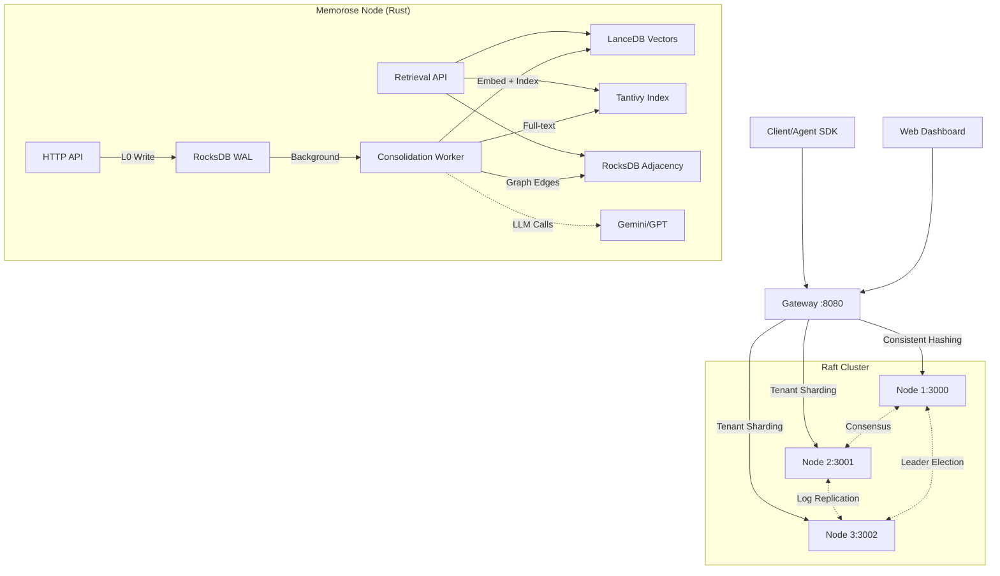

# Memorose 🧠

**Next-Generation AI Memory Database Inspired by Human Cognitive Architecture**

Memorose is a distributed memory system designed specifically for AI Agents. It goes beyond simple vector storage by mimicking the human brain's ability to **consolidate**, **forget**, and **automatically associate** memories across multiple abstraction levels.

[](LICENSE)
[](https://www.rust-lang.org/)

---

## ✨ Key Features

- 🧠 **Three-Layer Memory Architecture**: L0 (Sensory Stream) → L1 (Consolidated Memory) → L2 (Insight Graph)
- 🔄 **Automatic Consolidation**: Background workers compress and organize memories without manual intervention
- 🧹 **Active Forgetting**: Entropy filtering, temporal decay, and importance-based pruning
- 📊 **Knowledge Graph**: Auto-constructed semantic graph with community detection for insight generation
- ⚡ **High Performance**: Hybrid storage (RocksDB + LanceDB + Tantivy) optimized for different access patterns
- 🌐 **Distributed Architecture**: Raft-based consensus for high availability and horizontal scaling
- 🎨 **Web Dashboard**: Real-time visualization of memory graphs, clusters, and system metrics
- 🔐 **Multi-tenancy**: Complete isolation of tenant data with per-tenant streams

---

## 🧠 Design Philosophy

### 1. The Memory Continuum (记忆连续谱)

Memorose organizes data into three organic layers inspired by cognitive neuroscience:

**L0 - Sensory Stream (感觉记忆)**
- High-throughput, append-only WAL for raw event ingestion
- Like sensory memory: captures everything but holds it briefly
- Written to RocksDB for durability and fast sequential writes

**L1 - Consolidated Memory (工作记忆)**
- Semantically compressed and vectorized memories
- Deduplication and conflict resolution via LLM arbitration
- Indexed in LanceDB (vectors) + Tantivy (full-text) + RocksDB (graph)
- Supports hybrid search: semantic similarity + keyword matching + graph traversal

**L2 - Insight Graph (长期知识)**
- High-level patterns and insights derived from L1 clusters
- Community detection algorithms identify related memory groups
- LLM synthesizes cluster summaries into actionable insights
- Forms the "wisdom layer" for agents

### 2. Active Forgetting (主动遗忘)

Storage is not infinite, and retrieval noise degrades agent performance. Memorose implements **Adaptive Forgetting**:

- **Entropy Filtering**: Rejects low-information noise at ingestion (e.g., "hmm", "ok")
- **Temporal Decay**: Memory importance fades over time unless reinforced by access
- **Pruning**: Automatically removes memories below importance threshold
- **Conflict Resolution**: LLM arbitrator merges contradictory memories intelligently

### 3. Automatic Graph Construction (自动图谱构建)

You shouldn't have to manually manage edges:

- **Implicit Linking**: Auto-creates edges between memories based on vector similarity (cosine > 0.7)
- **Dynamic Weighting**: Relationships strengthen when memories are co-retrieved
- **Graph Algorithms**: PageRank, community detection, and centrality analysis out-of-the-box

---

## 🏗 Architecture

Memorose uses a **polyglot persistence** strategy to optimize for different workloads:



**Storage Engines:**
- **RocksDB**: High-speed L0 writes, metadata, graph adjacency lists
- **LanceDB**: Disk-based vector search (HNSW index) with sub-millisecond latency
- **Tantivy**: BM25 full-text search for precise keyword matching
- **Tokio**: Async runtime for concurrent request handling

**Distributed Features:**
- **Raft Consensus**: Leader election, log replication, and strong consistency
- **Snapshot Replication**: Full state transfer for new or recovering nodes
- **Tenant Sharding**: Consistent hashing distributes tenants across nodes
- **Auto-failover**: Client SDKs auto-redirect to new leader on failure

---

## 🚀 Quick Start

### Prerequisites

- **Rust**: 1.70+ (install via [rustup](https://rustup.rs/))
- **LLM API Key**: Required for semantic compression and insight generation
  - Google Gemini (recommended): Get key at [AI Studio](https://aistudio.google.com/app/apikey)
  - OpenAI (alternative): Get key at [OpenAI Platform](https://platform.openai.com/)

### Installation

1. **Clone the repository**
   ```bash
   git clone https://github.com/yourusername/memorose.git
   cd memorose
   ```

2. **Configure environment**
   ```bash
   cp .env.example .env
   # Edit .env and add your API key:
   # GOOGLE_API_KEY=your_actual_key_here
   ```

3. **Build the project**
   ```bash
   cargo build --release
   ```

### Run Examples (Recommended for Learning)

We provide comprehensive examples demonstrating core capabilities:

**1. Basic Operations** (Store, Search, Graph Traversal)
```bash
cargo run --example basic_operations
```

**2. Semantic Compression** (L0 → L1 Consolidation)
```bash
cargo run --example semantic_compression
# Demonstrates how verbose logs are compressed into concise memories
```

**3. Entropy Filtering** (Noise Reduction)
```bash
cargo run --example entropy_filtering
# Shows how low-information inputs are rejected
```

**4. Knowledge Graph Analysis** (Community Detection)
```bash
cargo run --example graph_analysis
# Builds a graph and identifies memory clusters
```

See [`examples/README.md`](examples/README.md) for detailed explanations.

---

## 🌐 Run as Distributed Service

### Single-Node Mode (Development)

```bash
# Terminal 1: Start the storage node
export GOOGLE_API_KEY="your_key_here"
cargo run --release -p memorose-server
# Listens on http://127.0.0.1:3000
# Dashboard available at http://127.0.0.1:3000/dashboard

# Terminal 2: Test with Python client
python3 examples/python/http_client.py
```

### Multi-Node Cluster (Production)

**Step 1: Start Storage Nodes**

```bash
# Node 1 (Leader candidate)
export GOOGLE_API_KEY="your_key_here"
export NODE_ID=node1
export RAFT_ADDR=127.0.0.1:5001
cargo run --release -p memorose-server -- --port 3001

# Node 2
export NODE_ID=node2
export RAFT_ADDR=127.0.0.1:5002
cargo run --release -p memorose-server -- --port 3002

# Node 3
export NODE_ID=node3
export RAFT_ADDR=127.0.0.1:5003
cargo run --release -p memorose-server -- --port 3003
```

**Step 2: Start Gateway (Load Balancer)**

```bash
export NODE_PREFIX="http://127.0.0.1:"
export SHARD_COUNT=3
cargo run --release -p memorose-gateway
# Listens on http://0.0.0.0:8080
```

**Step 3: Access Dashboard**

Open your browser: **http://localhost:3000/dashboard**

Default credentials: `admin` / `admin`

---

## 🎨 Web Dashboard

The dashboard provides real-time visualization and management:

- **Cluster View**: Node health, leader status, Raft metrics
- **Memory Explorer**: Browse L1 memories, view embeddings, inspect graph structure
- **Insight Viewer**: See L2 insights generated from memory clusters
- **Metrics**: Query latency, cache hit rate, consolidation throughput
- **Settings**: Configure consolidation intervals, forgetting thresholds, LLM models

**Dashboard Stack:**
- Next.js 14 (App Router)
- shadcn/ui components
- Tailwind CSS
- React Query for data fetching

**Build Dashboard:**
```bash
cd dashboard
npm install
npm run build
# Output: dashboard/out/ → copied to crates/memorose-server/static/dashboard/
```

---

## 📂 Project Structure

```
memorose/
├── crates/
│   ├── memorose-core/         # Core engine: storage, algorithms, workers
│   ├── memorose-server/        # HTTP server (Axum) + Raft node
│   ├── memorose-gateway/       # Stateless gateway with tenant sharding
│   └── memorose-common/        # Shared types, config, traits
├── dashboard/                  # Next.js web UI
│   ├── src/app/               # Pages: /cluster, /memories, /metrics, /login
│   └── src/components/        # UI components (shadcn/ui)
├── examples/                   # Rust examples and Python client
│   ├── python/                # Python SDK and examples
│   └── README.md              # Example documentation
└── docs/                       # Architecture docs, API specs
```

---

## 🛠 Configuration

### Environment Variables

| Variable | Description | Default |
|----------|-------------|---------|
| `LLM_PROVIDER` | LLM backend: `gemini` or `openai` | `gemini` |
| `GOOGLE_API_KEY` | Google Gemini API key | - |
| `OPENAI_API_KEY` | OpenAI API key (if using OpenAI) | - |
| `LLM_MODEL` | Model for compression/insights | `gemini-2.0-flash` |
| `EMBEDDING_MODEL` | Model for vectorization | `text-embedding-004` |
| `RUST_LOG` | Log level: `error/warn/info/debug/trace` | `info` |
| `NODE_PREFIX` | Gateway: URL prefix for nodes | `http://127.0.0.1:` |
| `SHARD_COUNT` | Gateway: Number of shards | `2` |

See [`.env.example`](.env.example) for complete configuration template.

### Consolidation Tuning

Edit server config (`crates/memorose-server/config.toml`):

```toml
[consolidation]
interval_secs = 10          # Run consolidation every 10s
batch_size = 100            # Process up to 100 L0 events per batch
entropy_threshold = 2.5     # Reject inputs with entropy < 2.5
similarity_threshold = 0.7  # Auto-link memories with cosine > 0.7

[forgetting]
decay_half_life_days = 30   # Importance halves every 30 days
min_importance = 0.1        # Prune memories with importance < 0.1
```

---

## 📊 Performance & Benchmarks

Memorose performance and accuracy benchmarks are available in the companion project:

**[ai-memory-benchmark/](../ai-memory-benchmark/)**

**Benchmarks Included:**
- **HaluMem**: Hallucination-free memory recall (100% recall, 50% QA accuracy)
- **PersonaMem**: Persona consistency (100% accuracy)
- **LoCoMo**: Long conversation memory (L2 Insight: 100% quality)
- **LongMemEval**: Long-term memory retrieval (targeting 75% accuracy)

**Optimizations Achieved:**
- 🚀 **1273x cache speedup** for repeated queries
- 🧠 **LoCoMo L2 quality**: 0% → 100%
- ⚡ **10x batch query** parallelization
- 🎯 **Multi-strategy retrieval** for higher recall

See [`ai-memory-benchmark/FINAL_PROJECT_REPORT.md`](../ai-memory-benchmark/FINAL_PROJECT_REPORT.md) for detailed results.

---

## 🔌 API Reference

### Core Endpoints

**Ingest Event (L0 Write)**
```http
POST /api/v1/events
Content-Type: application/json

{
  "tenant_id": "user_123",
  "stream_id": "chat_session_1",
  "content": "User mentioned they prefer dark mode",
  "metadata": {
    "source": "chat",
    "timestamp": "2024-02-09T10:30:00Z"
  }
}
```

**Retrieve Memories (Hybrid Search)**
```http
POST /api/v1/retrieve
Content-Type: application/json

{
  "tenant_id": "user_123",
  "stream_id": "chat_session_1",
  "query": "What are the user's UI preferences?",
  "top_k": 10,
  "graph_depth": 2,
  "enable_arbitration": true
}
```

**Get L2 Insights**
```http
GET /api/v1/insights?tenant_id=user_123&stream_id=chat_session_1
```

### Python SDK

```python
from memorose_client import MemoroseClient

client = MemoroseClient("http://localhost:8080")

# Ingest
client.ingest("user_123", "session_1", "User loves hiking")

# Retrieve
results = client.retrieve(
    tenant_id="user_123",
    stream_id="session_1",
    query="outdoor activities",
    top_k=5,
    graph_depth=1
)

# Get insights
insights = client.get_insights("user_123", "session_1")
```

---

## 🔮 Roadmap

### ✅ Completed

- [x] **Three-Layer Architecture**: L0 → L1 → L2 memory continuum
- [x] **Hybrid Storage**: RocksDB + LanceDB + Tantivy integration
- [x] **Active Forgetting**: Entropy filtering, temporal decay, pruning
- [x] **Auto Graph Construction**: Similarity-based linking + dynamic weighting
- [x] **Distributed Raft Cluster**: Leader election, log replication, failover
- [x] **Snapshot Replication**: Full state transfer for new nodes
- [x] **Multi-tenancy V2**: Physical isolation of tenant data
- [x] **Web Dashboard**: Cluster monitoring, memory explorer, metrics
- [x] **Bi-temporal Model**: Support `valid_time` vs `transaction_time`
- [x] **Community Detection**: Graph-based L2 insight generation
- [x] **Smart Client SDK**: Auto-retry and leader redirection
- [x] **Production Benchmarks**: HaluMem, LoCoMo, LongMemEval validation

### 🚧 In Progress

- [ ] **Test Coverage**: 90%+ unit test coverage across all crates
- [ ] **Docker Deployment**: Official Docker images and Kubernetes Helm charts
- [ ] **Metrics Export**: Prometheus/OpenTelemetry integration

### 📝 Future

- [ ] **Multi-modal Memory**: Support image/audio embeddings via CLIP/Whisper
- [ ] **Federated Learning**: Privacy-preserving collaborative memory
- [ ] **Streaming Consolidation**: Real-time L0→L1 instead of batch processing
- [ ] **Advanced Forgetting**: Reinforcement learning for optimal retention policies
- [ ] **Graph Neural Networks**: GNN-based insight generation beyond community detection

---

## 🤝 Contributing

Contributions are welcome! Please read our [Contributing Guide](CONTRIBUTING.md) first.

**Areas We Need Help:**
- Test coverage improvements
- Documentation and examples
- Performance benchmarking
- Multi-modal support (images, audio)

---

## 📄 License

This project is licensed under the **MIT License** - see the [LICENSE](LICENSE) file for details.

---

## 🙏 Acknowledgments

**Inspired by:**
- **Neuroscience**: Atkinson-Shiffrin memory model, Ebbinghaus forgetting curve
- **Databases**: RocksDB (LSM-Tree), LanceDB (columnar vectors), DuckDB (analytical queries)
- **Graph Theory**: Louvain community detection, PageRank centrality
- **AI Research**: RAG (Retrieval-Augmented Generation), semantic compression, memory consolidation

**Built with:**
- [Rust](https://www.rust-lang.org/) - Systems programming language
- [Tokio](https://tokio.rs/) - Async runtime
- [RocksDB](https://rocksdb.org/) - Key-value store
- [LanceDB](https://lancedb.com/) - Vector database
- [Tantivy](https://github.com/quickwit-oss/tantivy) - Full-text search
- [Next.js](https://nextjs.org/) - Web dashboard framework

---

**Built with ❤️ for the next generation of AI agents**

For questions or support, please open an issue or join our community.
