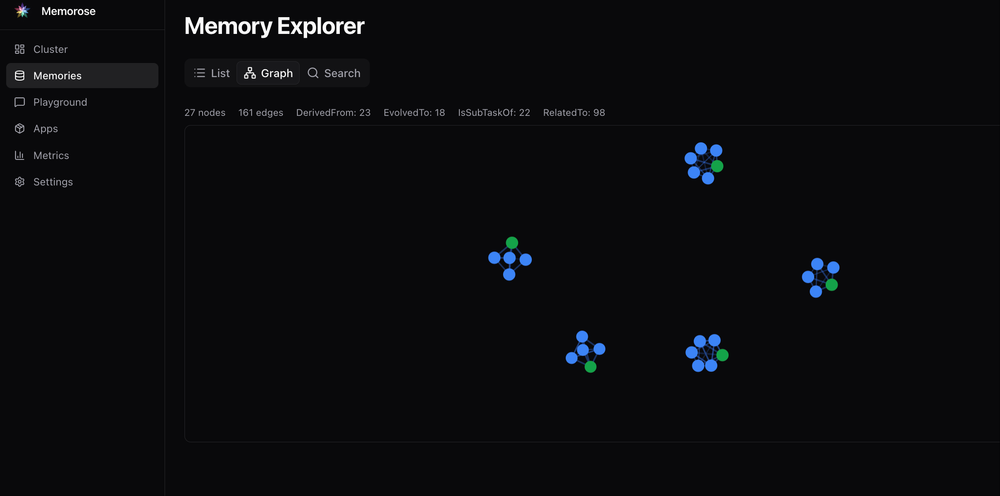

# Memorose

<p align="center">
  
</p>

<p align="center">
  <em>"Stat rosa pristina nomine, nomina nuda tenemus."</em><br/>
  <em>"The rose of old remains only in its name; we possess naked names."</em><br/>
  — Bernard of Cluny, 12th Century
</p>

---

**Memorose** (Memory + Rose) — inspired by the eternal rose — is a distributed, multimodal long-term memory lake for the AI era. Built on a timeless truth: **while things fade, memory endures**. We are crafting the most **reliable**, **evolving**, and **shared** memory infrastructure where humans and AI agents collaborate through unified context, transforming ephemeral data into enduring wisdom.

---

<p align="center">
  <b>⭐ If you find Memorose useful, please star this repo! ⭐</b><br/>
  <i>Your support helps us build the future of AI memory</i>
</p>

[](LICENSE)
[](https://www.rust-lang.org/)
[](https://github.com/ai-akashic/Memorose/stargazers)

**Next-generation AI memory infrastructure** — A scalable, multimodal memory lake that self-evolves through automatic consolidation, intelligent forgetting, and semantic knowledge graphs.

## ✨ Key Features

- 🧠 **Three-Layer Architecture**: L0 (Raw Events) → L1 (Consolidated Memory) → L2 (Insights)
- 🧹 **Active Forgetting**: Entropy filtering, temporal decay, and importance-based pruning
- 🔗 **Auto Graph Construction**: Semantic relationships built automatically
- ⚡ **Hybrid Storage**: RocksDB + LanceDB + Tantivy for optimal performance
- 🌐 **Distributed**: Raft consensus for high availability
- 🎨 **Web Dashboard**: Real-time visualization and management

## 🏗 Architecture

<p align="center">
  
  <br/>
  <em>✏️ <a href="docs/architecture.drawio">Click here to edit the architecture diagram in Draw.io</a></em>
</p>

**Storage Stack:**
- **RocksDB**: L0 WAL writes, metadata, graph edges
- **LanceDB**: Vector search with HNSW indexing
- **Tantivy**: Full-text search (BM25)

**Distributed Features:**
- Raft consensus for strong consistency
- Automatic failover and leader election

## 🚀 Quick Start

**Prerequisites:** Rust 1.70+ and a [Gemini API Key](https://aistudio.google.com/app/apikey)

```bash
# 1. Setup
git clone https://github.com/ai-akashic/Memorose.git
cd memorose
cp .env.example .env
# Add your GOOGLE_API_KEY to .env

# 2. Configure (optional)
cp config.example.toml config.toml
# Edit config.toml if needed

# 3. Start server
./scripts/start_cluster.sh start --mode standalone --clean --build

# 4. Open dashboard
open http://localhost:3000/dashboard  # Login: admin/admin
```

**Troubleshooting:** If you see Raft errors, run `./reset_to_standalone.sh`

## 📸 Dashboard

<p align="center">
  
</p>

*Browse memories, visualize knowledge graphs, and monitor cluster status in real-time*

## ⚙️ Configuration

Edit `config.toml` and `.env` for custom settings:

**config.toml** (structure & behavior):
```toml
[consolidation]
enabled = true
interval_secs = 1           # Consolidation frequency
batch_size = 20             # Events per batch
entropy_threshold = 1.5     # Noise filtering (lower = accept more)

[consolidation.llm]
provider = "gemini"
model = "gemini-2.0-flash-exp"
embedding_model = "text-embedding-004"
```

**.env** (secrets):
```bash
GOOGLE_API_KEY=your_key_here
RUST_LOG=info
```

See [config.example.toml](config.example.toml) for all options.

## 📚 Usage Examples

**Basic Operations:**
```bash
cargo run --example basic_operations      # Store, search, graph
cargo run --example semantic_compression  # L0 → L1 consolidation
cargo run --example graph_analysis        # Knowledge graph queries
```

**Python Client:**
```python
from memorose_client import MemoroseClient

client = MemoroseClient("http://localhost:3000")

# Ingest events
client.ingest("user_123", "session_1", "User loves hiking")

# Retrieve memories
results = client.retrieve(
    user_id="user_123",
    stream_id="session_1",
    query="outdoor activities",
    top_k=5
)
```

See [examples/README.md](examples/README.md) for more.

## 📂 Project Structure

```
memorose/
├── crates/
│   ├── memorose-core/      # Core engine (storage, consolidation, graph)
│   ├── memorose-server/    # HTTP server + Raft node
│   ├── memorose-gateway/   # API Gateway and request router
│   └── memorose-common/    # Shared types and config
├── dashboard/              # Next.js web UI
├── examples/               # Rust examples + Python SDK
└── docs/                   # Architecture docs
```

## 🔌 API Reference

**Ingest Event:**
```http
POST /api/v1/events
{
  "user_id": "user_123",
  "stream_id": "chat_session_1",
  "content": "User mentioned they prefer dark mode"
}
```

**Retrieve Memories:**
```http
POST /api/v1/retrieve
{
  "user_id": "user_123",
  "query": "What are the user's UI preferences?",
  "top_k": 10
}
```

Full API docs: [docs/API.md](docs/API.md)

## 🔮 Roadmap

**Completed:** Three-layer architecture • Distributed Raft cluster • Active forgetting • Auto graph construction • Web dashboard

**In Progress:**
- Comprehensive benchmarks (HaluMem, PersonaMem, LoCoMo, LongMemEval)
- Test coverage • Docker/K8s deployment
- **Multi-Model Provider Support**: Expanding the `LLMClient` trait beyond Gemini to officially support OpenAI (GPT-4o, text-embedding-3), DeepSeek, and local open-source models (vLLM/Ollama) for cost/performance routing.
- **Token & Cost Optimization**: Advanced prompt packing, semantic deduplication, and caching strategies to minimize LLM token burn during continuous consolidation.
- **Dual-Track Memory Pipelines**: Architectural separation of `User Memory` (factual profile extraction) and `Agent Memory` (procedural state & trajectory summaries) using isolated namespaces and specialized LLM extraction prompts.

**Future:**
- **Native Multi-modal Memory**: Seamlessly encode, compress, and retrieve images, audio, and visual screen-states alongside text semantics.
- **Deep Graph Reasoning (GraphRAG)**: Advanced multi-hop entity reasoning across the auto-constructed knowledge graph to answer complex relational queries.
- **Episodic & Action Memory**: Specialized memory pathways for agent tool-use, capturing execution history, outcomes, and reflexions (experience-based learning) distinct from factual knowledge.
- **Custom Rerankers (Cross-Encoders/LLMs)**: Pluggable reranking interfaces allowing users to bring their own BGE-Reranker or LLM-based judges to override the default heuristic scoring.
- Federated learning

## 📄 License

Apache License 2.0 - see [LICENSE](LICENSE)

## 📚 References

- [SimpleMem: Efficient Lifelong Memory for LLM Agents](https://arxiv.org/abs/2601.02553)
- [G-Memory: Tracing Hierarchical Memory for Multi-Agent Systems](https://arxiv.org/abs/2506.07398)
- [From Human Memory to AI Memory: Memory Mechanisms in the Era of LLMs](https://arxiv.org/abs/2504.15965)

---

**Built with ❤️ for next-generation AI agents**

For questions or support, please open an issue.
