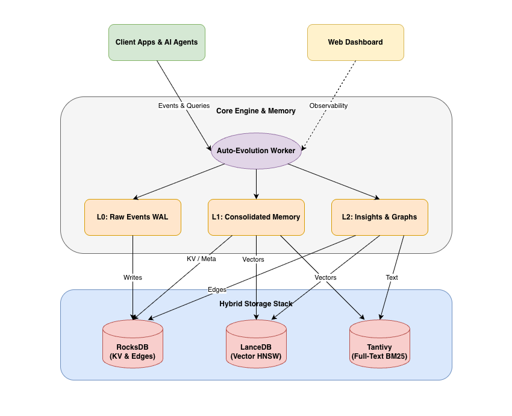
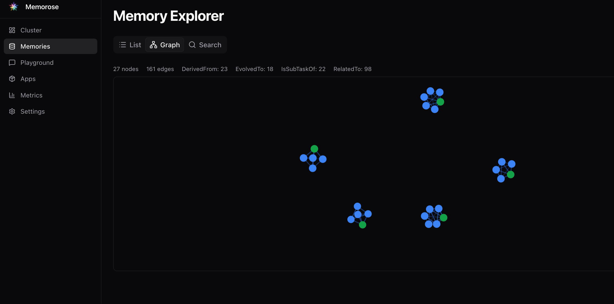

# Memorose

<p align="center">
  
</p>

<p align="center">
  <em>"Stat rosa pristina nomine, nomina nuda tenemus."</em><br/>
  <em>"The rose of old remains only in its name; we possess naked names."</em><br/>
  — Bernard of Cluny, 12th Century
</p>

---

**Memorose** (Memory + Rose) — inspired by the eternal rose — is a distributed, multimodal long-term memory lake for the AI era. Built on a timeless truth: **while things fade, memory endures**. We are crafting the most **reliable**, **evolving**, and **shared** memory infrastructure where humans and AI agents collaborate through unified context, transforming ephemeral data into enduring wisdom.

---

<p align="center">
  <b>⭐ If you find Memorose useful, please star this repo! ⭐</b><br/>
  <i>Your support helps us build the future of AI memory</i>
</p>

[](LICENSE)
[](https://www.rust-lang.org/)
[](https://github.com/ai-akashic/Memorose/stargazers)

**Next-generation AI memory infrastructure** — A scalable, multimodal memory lake that self-evolves through automatic consolidation, intelligent forgetting, and semantic knowledge graphs.

## ✨ Key Features

- 🧠 **Multi-Level Architecture**: L0 (Raw) → L1 (Semantic) → L2 (Graph) → L3 (Tasks)
- 🧹 **Active Forgetting**: Entropy filtering, temporal decay, and importance-based pruning
- 🔗 **Auto Graph Construction**: Semantic relationships built automatically
- ⚡ **Hybrid Storage**: RocksDB + LanceDB + Tantivy for optimal performance
- 🌐 **Distributed**: Raft consensus for high availability
- 🎨 **Web Dashboard**: Real-time visualization and management

## 🧠 Core Concepts

### Multi-Level Memory Architecture (L0-L3)
Memorose implements a hierarchical memory system inspired by human cognitive processes:
- **L0 (Episodic/Raw Events)**: The immutable stream of raw interactions, observations, and events. Acts as the foundational Write-Ahead Log (WAL) of experience.
- **L1 (Semantic/Consolidated)**: Automatically consolidated entities, facts, and preferences extracted from L0. These are deduplicated, vectorized, and semantically searchable.
- **L2 (Insights/Graph)**: High-level abstractions, patterns, and rules generated by LLMs analyzing L1 memory clusters. Represented as a semantic knowledge graph for deep reasoning (GraphRAG).
- **L3 (Action/Task Memory)**: Specialized memory pathways for agent tool-use, goal planning, and execution history. It supports automatic task decomposition (Goals → Milestones) and experience-based learning (Procedural Memory).

### Multi-Dimensional Memory Scopes
To support complex multi-agent systems and enterprise use cases, Memorose provides fine-grained data isolation and cross-pollination through distinct memory scopes:
- **User Memory (`user_id`)**: The foundational isolation layer. Represents the private, personal memory and facts of an individual user across their interactions.
- **Agent Memory (`agent_id`)**: Enables AI agents to maintain their own "procedural memory" (e.g., how to solve a specific problem). Agents can remember their past reasoning steps, successful tool uses, and learned rules, distinct from factual user data.
- **Organization Memory (`org_id`)**: Allows grouping memories across multiple users within a single tenant/organization. Ideal for federated learning, enterprise knowledge bases, and building global L2 insights while maintaining underlying user privacy.
- **App Memory (`app_id`)**: Scopes memories to specific applications or contexts to prevent context-pollution (e.g., separating a coding assistant's memories from a casual chat app).

## 🏗 Architecture

<p align="center">
  
  <br/>
  <em>✏️ <a href="docs/architecture.drawio">Click here to edit the architecture diagram in Draw.io</a></em>
</p>

**Storage Stack:**
- **RocksDB**: L0 WAL writes, metadata, graph edges
- **LanceDB**: Vector search with HNSW indexing
- **Tantivy**: Full-text search (BM25)

**Distributed Features:**
- Raft consensus for strong consistency
- Automatic failover and leader election

## 🚀 Quick Start

### Using Docker (Recommended)

The easiest way to run Memorose is using the official Docker image. We provide a ready-to-use Docker Compose setup for a standalone instance.

1. **Create `docker-compose.yml`**:
```yaml
version: '3.8'

services:
  memorose:
    image: aiakashic/memorose:latest
    ports:
      - "3000:3000"
    environment:
      - RUST_LOG=info
      - GOOGLE_API_KEY=${GOOGLE_API_KEY}
      - LLM_PROVIDER=gemini
    volumes:
      - memorose_data:/app/data
    restart: unless-stopped

volumes:
  memorose_data:
```

2. **Start the server**:
```bash
export GOOGLE_API_KEY="your_api_key_here"
docker-compose up -d
```
The API and Dashboard will be available at `http://localhost:3000`.

---

### From Source

**Prerequisites:** Rust 1.70+ and a [Gemini API Key](https://aistudio.google.com/app/apikey)

```bash
# 1. Setup
git clone https://github.com/ai-akashic/Memorose.git
cd memorose
cp .env.example .env
# Add your GOOGLE_API_KEY to .env

# 2. Configure (optional)
cp config.example.toml config.toml
# Edit config.toml if needed

# 3. Start server
./scripts/start_cluster.sh start --mode standalone --clean --build

# 4. Open dashboard
open http://localhost:3000/dashboard  # Login: admin/admin
```

**Troubleshooting:** If you see Raft errors, run `./reset_to_standalone.sh`

## 📸 Dashboard

<p align="center">
  
</p>

*Browse memories, visualize knowledge graphs, and monitor cluster status in real-time*

## 🎬 Demo Video

[](https://www.youtube.com/watch?v=Ndb5_mCMboQ)

[Watch on YouTube](https://www.youtube.com/watch?v=Ndb5_mCMboQ)

## ⚙️ Configuration

Edit `config.toml` and `.env` for custom settings:

**config.toml** (structure & behavior):
```toml
[consolidation]
enabled = true
interval_secs = 1           # Consolidation frequency
batch_size = 20             # Events per batch
entropy_threshold = 1.5     # Noise filtering (lower = accept more)

[consolidation.llm]
provider = "gemini"
model = "gemini-3.1-flash-lite-preview"
embedding_model = "text-embedding-004"
```

**.env** (secrets):
```bash
GOOGLE_API_KEY=your_key_here
RUST_LOG=info
```

See [config.example.toml](config.example.toml) for all options.

## 📚 Usage Examples

**Basic Operations:**
```bash
cargo run --example basic_operations      # Store, search, graph
cargo run --example semantic_compression  # L0 → L1 consolidation
cargo run --example graph_analysis        # Knowledge graph queries
```

**Python Client:**
```python
from memorose_client import MemoroseClient

client = MemoroseClient("http://localhost:3000")

# Ingest events
client.ingest("user_123", "session_1", "User loves hiking")

# Retrieve memories
results = client.retrieve(
    user_id="user_123",
    stream_id="session_1",
    query="outdoor activities",
    top_k=5
)
```

See [examples/README.md](examples/README.md) for more.

## 📂 Project Structure

```
memorose/
├── crates/
│   ├── memorose-core/      # Core engine (storage, consolidation, graph)
│   ├── memorose-server/    # HTTP server + Raft node
│   ├── memorose-gateway/   # API Gateway and request router
│   └── memorose-common/    # Shared types and config
├── dashboard/              # Next.js web UI
├── examples/               # Rust examples + Python SDK
└── docs/                   # Architecture docs
```

## 🔌 API Reference

**Ingest Event:**
```http
POST /api/v1/events
{
  "user_id": "user_123",
  "stream_id": "chat_session_1",
  "content": "User mentioned they prefer dark mode"
}
```

**Retrieve Memories:**
```http
POST /api/v1/retrieve
{
  "user_id": "user_123",
  "query": "What are the user's UI preferences?",
  "top_k": 10
}
```

Full API docs: [docs/API.md](docs/API.md)

## 🔮 Roadmap

**Completed:** Three-layer architecture • Episodic & Action Memory (L3 Task Trees) • Distributed Raft cluster • Active forgetting • Auto graph construction • Web dashboard • Multi-Model Provider Support • Dual-Track Memory Pipelines • Token & Cost Optimization • Deep Graph Reasoning (GraphRAG) • Native Multi-modal Memory (Vision)

**In Progress:**
- **Agent Reflexion & Experience Learning**: Enhancing L3 tasks with execution outcomes, tool-use history, and automatic reflexions to guide future planning.
- SDKs (Python, Node.js)
- Comprehensive benchmarks (HaluMem, PersonaMem, LoCoMo, LongMemEval)
- Test coverage • Docker/K8s deployment

**Future:**
- **Custom Rerankers (Cross-Encoders/LLMs)**: Pluggable reranking interfaces allowing users to bring their own BGE-Reranker or LLM-based judges to override the default heuristic scoring.
- Federated learning

## 📄 License

Apache License 2.0 - see [LICENSE](LICENSE)

## 📚 References

- [SimpleMem: Efficient Lifelong Memory for LLM Agents](https://arxiv.org/abs/2601.02553)
- [G-Memory: Tracing Hierarchical Memory for Multi-Agent Systems](https://arxiv.org/abs/2506.07398)
- [From Human Memory to AI Memory: Memory Mechanisms in the Era of LLMs](https://arxiv.org/abs/2504.15965)

---

**Built with ❤️ for next-generation AI agents**

For questions or support, please open an issue.
