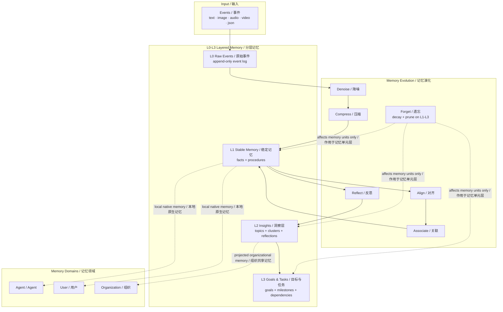

<div align="center">
  <br />
  <a href="https://memorose.dev">
    
  </a>
  <h1>Memorose</h1>
  <p><b>The open-source memory runtime for AI agents.</b></p>
  <p>Persistent memory, procedural recall, shared knowledge, and forgetting in one Rust-native stack.</p>
  <p>
    <a href="./README-zh.md"><b>简体中文</b></a>
  </p>
  <br />
  <p>
    <a href="https://memorose.dev/docs"><b>Documentation</b></a> &nbsp;&bull;&nbsp;
    <a href="https://memorose.dev"><b>Website</b></a> &nbsp;&bull;&nbsp;
    <a href="https://github.com/ai-akashic/Memorose/issues"><b>Issues</b></a> &nbsp;&bull;&nbsp;
    <a href="https://discord.gg/memorose"><b>Discord</b></a>
  </p>
  <p>
    <a href="https://github.com/ai-akashic/Memorose/stargazers"></a>
    <a href="https://github.com/ai-akashic/Memorose/releases"></a>
    <a href="https://github.com/ai-akashic/Memorose/blob/main/LICENSE"></a>
    
    <a href="https://github.com/ai-akashic/Memorose/commits/main"></a>
  </p>
  <br />
</div>

<p align="center">
  
</p>
<p align="center"><sub>Memorose is not a vector wrapper. It is a memory runtime for agents: ingest, consolidate, retrieve, reflect, share, and forget in one system.</sub></p>

---

## 💡 Why Memorose?

Most agent memory systems are still vector stores with nicer branding. Real agents need a memory runtime that can remember facts and procedures, evolve memory over time, and enforce boundaries across agent, user, and organization scopes.

**Memorose** is a self-hosted Rust system built for that exact job:

- **Layered Memory:** From raw events to stable memory, insights, and goals.
- **Factual + Procedural:** Stores both what happened and *how* work gets done.
- **Domain-Aware:** Strict isolation across agent, user, and organization scopes.
- **Hybrid Retrieval:** Vectors, text search, graph expansion, and reranking combined.
- **Continuous Evolution:** Denoising, compression, linking, reflection, and active forgetting.
- **Multimodal Native:** Text, image, audio, and video enter the same memory system.
- **Rust-Native Stack:** Embedded storage with no Python dependency chains.

One binary. Self-hosted. Sub-10ms retrieval target. Built for agents that need a real memory system.

---

## ✨ Highlights

### 📚 Layered Memory
Raw events become stable memory, insights, and goals through a clear L0-L3 pipeline.

### 🔐 Scoped by Design
Memory is isolated across agent, user, and organization scopes before it is shared upward.

### 🧠 Facts + Procedures
Store both what happened (facts) and how work gets done (procedures).

### 🔍 Hybrid Retrieval
Vectors, full-text, graph expansion, and reranking work together in one unified stack.

### 🧬 Memory Evolution
Denoise, compress, align, associate, reflect, and forget are built directly into the runtime.

### 🎞️ Multimodal Native
Text, image, audio, and video can enter and be searched within the same memory system.

---

## 🚀 Quick Start

### Step 1: Run Memorose
Start with Docker, or build from source if you want the full local stack.

```bash
docker run -d -p 3000:3000 \
  -e GOOGLE_API_KEY=your_key \
  -e MEMOROSE__LLM__MODEL=gemini-2.0-flash \
  -e MEMOROSE__LLM__EMBEDDING_MODEL=gemini-embedding-2-preview \
  dylan2024/memorose:latest
```

<details>
<summary><b>Or build from source</b></summary>

```bash
git clone https://github.com/ai-akashic/Memorose.git
cd Memorose
cargo build --release
./target/release/memorose-server
```
</details>

### Step 2: Ingest an event
Send one interaction, observation, or tool result into the memory runtime.

```bash
export STREAM=$(uuidgen)

curl -s -X POST http://localhost:3000/v1/users/dylan/streams/$STREAM/events \
  -H "Content-Type: application/json" \
  -d '{"content": "I prefer Rust over Python. I hate unnecessary meetings. My dog is named Rosie."}'
```

### Step 3: Retrieve with memory
Ask a new query and let the agent recall stable memory, not just the latest context window.

```bash
curl -s -X POST http://localhost:3000/v1/users/dylan/streams/$STREAM/retrieve \
  -H "Content-Type: application/json" \
  -d '{"query": "What should I keep in mind when working with Dylan?"}'
```

<details>
<summary><b>Cross-modal query example</b></summary>

```bash
curl -s -X POST http://localhost:3000/v1/users/dylan/streams/$STREAM/retrieve \
  -H "Content-Type: application/json" \
  -d '{"query": "what is this?", "image": "'$(base64 -i photo.jpg)'"}'
```
</details>

**Response:**
```json
{
  "results": [
    ["Dylan prefers Rust, dislikes unnecessary meetings, has a dog named Rosie", 0.94]
  ]
}
```

---

## 🏗️ How It Works

Memorose processes memories through a 4-tier cognitive pipeline, modeled after human memory consolidation:

```text
  Event (text/image/audio/video/json)
    │
    ▼
┌─────────────────────────────────────────────────────┐
│  L0  Working Memory                                 │
│  Raw event log. Append-only. Zero processing.       │
│  ► RocksDB                                          │
└──────────────────────┬──────────────────────────────┘
                       │  Background workers (async)
                       ▼
┌─────────────────────────────────────────────────────┐
│  L1  Episodic Memory                                │
│  Compressed summaries. Vectorized. Auto-linked.     │
│  ► RocksDB + LanceDB + Tantivy                     │
│                                                     │
│  Operations: Compress ─► Embed ─► Associate         │
└──────────────────────┬──────────────────────────────┘
                       │  Community detection + LLM synthesis
                       ▼
┌─────────────────────────────────────────────────────┐
│  L2  Semantic Memory                                │
│  Abstract knowledge clusters. Cross-session insight.│
│  ► Knowledge Graph                                  │
│                                                     │
│  Operations: Insight ─► Reflect                     │
└──────────────────────┬──────────────────────────────┘
                       │  Goal decomposition
                       ▼
┌─────────────────────────────────────────────────────┐
│  L3  Goal Memory                                    │
│  Hierarchical task trees. Progress tracking.        │
│  ► RocksDB                                          │
└─────────────────────────────────────────────────────┘

  ↕ Forgetting runs continuously across all tiers:
    importance decay + threshold pruning + deduplication
```

### Unified Memory Map


<details>
<summary><b>View Mermaid Diagram</b></summary>


```mermaid
flowchart TD
    subgraph Input["Input / 输入"]
        I["Events / 事件<br/>text · image · audio · video · json"]
    end

    subgraph Layers["L0-L3 Layered Memory / 分层记忆"]
        L0["L0 Raw Events / 原始事件<br/>append-only event log"]
        L1["L1 Stable Memory / 稳定记忆<br/>facts + procedures"]
        L2["L2 Insights / 洞察层<br/>topics + clusters + reflections"]
        L3["L3 Goals & Tasks / 目标与任务<br/>goals + milestones + dependencies"]
    end

    subgraph Evolution["Memory Evolution / 记忆演化"]
        E1["Denoise / 降噪"]
        E2["Compress / 压缩"]
        E3["Align / 对齐"]
        E4["Associate / 关联"]
        E5["Reflect / 反思"]
        E6["Forget / 遗忘<br/>decay + prune on L1-L3"]
    end

    subgraph Domains["Memory Domains / 记忆领域"]
        D1["Agent / Agent"]
        D2["User / 用户"]
        D3["Organization / 组织"]
    end

    I --> L0
    L0 --> E1 --> E2 --> L1
    L1 --> E3 --> E4 --> L1
    L1 --> E5 --> L2
    L2 --> L3
    L1 -. local native memory / 本地原生记忆 .-> D1
    L1 -. local native memory / 本地原生记忆 .-> D2
    L2 -. projected organizational memory / 组织共享记忆 .-> D3
    E6 -. affects memory units only / 作用于记忆单元层 .-> L1
    E6 -. affects memory units only / 作用于记忆单元层 .-> L2
    E6 -. affects memory units only / 作用于记忆单元层 .-> L3
```
</details>

---

## 🌐 Multi-Dimensional Memory

Every memory is indexed across three core dimensions:

```text
Organization (org_id)    ← Shared organizational boundary
  ├─ User (user_id)      ← Factual: preferences, facts, profile
  └─ Agent (agent_id)    ← Procedural: tool usage, strategies, reflections
```

| Dimension | What it captures | Example |
|-----------|-----------------|---------|
| **Organization** | Shared boundary for reusable organizational knowledge | `org: acme-corp` |
| **User** | Facts, preferences, personal context | _"Dylan prefers Rust and hates meetings"_ |
| **Agent** | Execution trajectories, learned strategies, tool patterns | _"API X fails on large payloads — use streaming instead"_ |

---

## ⚙️ Memory Domains

Memorose separates **cognitive tier** from **memory domain**:

- **L0-L3** describes how memory is processed over time
- **Agent / User / Organization** describes who a memory belongs to and who it should serve

| Domain | Primary question | Typical content | Default sharing boundary |
|--------|------------------|-----------------|--------------------------|
| **Agent Memory** | _How does this agent do the work?_ | Tool usage patterns, execution traces, recovery strategies | Private to one `agent_id` unless projected upward |
| **User Memory** | _Who is this user and what do they want?_ | Preferences, identity, goals, constraints, personal context | Shared across agents serving the same `user_id` |
| **Organization Memory** | _What knowledge is reusable across the org?_ | Policies, terminology, shared workflows, generalized practices | Shared within one `org_id`, subject to user opt-in |

---

## 🔄 Six Cognitive Operations

These six operations form the memory evolution pipeline:

1. **Align**: Map multimodal input (text, image, audio, video) to structured events.
2. **Compress**: LLM-extract high-density facts from verbose conversations (L0 → L1).
3. **Associate**: Auto-link semantically similar memories via cosine similarity.
4. **Insight**: Community detection (Louvain/LPA) + LLM synthesis of abstract knowledge.
5. **Reflect**: Per-session retrospective: what happened, what was learned.
6. **Forget**: Importance decay + threshold pruning + semantic deduplication.

---

## 📊 Feature Comparison

| Feature | Memorose | Mem0 | Zep | ChromaDB |
|---------|:--------:|:----:|:---:|:--------:|
| Open Source | **Yes** | Partial | Yes | Yes |
| Self-Hosted | **Yes** | No | Yes | Yes |
| Hybrid Search (Vector + BM25) | **Yes** | No | Yes | No |
| Knowledge Graph | **Yes** | Yes | No | No |
| Native Multimodal Embedding | **Yes** | No | No | No |
| Active Forgetting | **Yes** | No | No | No |
| Raft Replication | **Yes** | No | No | No |
| Built-in Dashboard | **Yes** | Yes | No | No |
| Language | **Rust** | Python | Go | Python |
| Latency (p99) | **<10ms** | ~50ms | ~30ms | ~20ms |

---

## ⚡ Performance

Benchmarked on a single 8-core node with 1M stored memories:

- **Search Latency**: <8ms p99 (hybrid vector + BM25)
- **Write Throughput**: 50K ops/sec sustained
- **Memory Footprint**: ~120 MB baseline
- **Cold Start**: <200ms to first query

---

## 🖥️ Dashboard

Memorose includes a modern, glassmorphic Next.js dashboard that runs as a separate web app.

**Recommended local startup:**
```bash
./scripts/start_cluster.sh start --clean --build
```

**Features:**
- **Memory Browser:** Search, filter by organization/user/agent, inspect memories.
- **Knowledge Graph:** Interactive visualization of memory relationships.
- **Playground:** Live query testing with real-time results and multi-modal chat.
- **Cluster Health:** Multi-node Raft status monitoring.

---

## 📖 API Reference

| Method | Endpoint | Description |
|--------|----------|-------------|
| `POST` | `/v1/users/:uid/streams/:sid/events` | Ingest event (text, image, audio, video, json) |
| `POST` | `/v1/users/:uid/streams/:sid/retrieve` | Hybrid search with optional cross-modal query |
| `GET` | `/v1/users/:uid/tasks/tree` | Get all goal/task hierarchies |
| `GET` | `/v1/users/:uid/tasks/ready` | Get auto-executable tasks |
| `PUT` | `/v1/users/:uid/tasks/:tid/status` | Update task status |
| `POST` | `/v1/users/:uid/graph/edges` | Add graph edge |
| `GET` | `/v1/status/pending` | Pending event count |

---

## 🛣️ Roadmap

- [ ] Python & TypeScript SDKs
- [ ] Streaming event ingestion (WebSocket / SSE)
- [ ] Helm chart for Kubernetes deployment
- [ ] Plugin system for custom memory processors

---

## 🤝 Contributing

We welcome contributions of all kinds.

```bash
# Fork, clone, then:
cargo test -p memorose-core
cargo run -p memorose-server
```

See [CONTRIBUTING.md](CONTRIBUTING.md) for guidelines.

## 📄 License

[Apache License 2.0](LICENSE)

<br />
<div align="center">
  <sub>Built with Rust. Designed for agents that remember.</sub>
</div>

