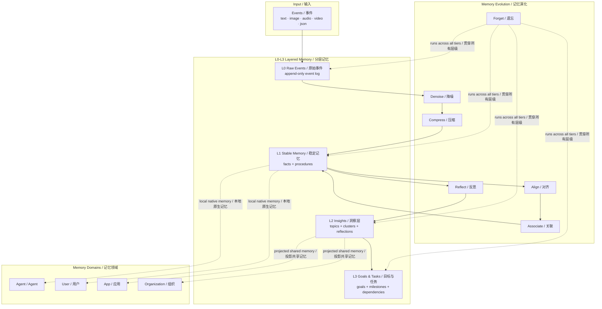

<div align="center">
  <br />
  <a href="https://memorose.io">
    
  </a>
  <h1>Memorose</h1>
  <p><b>The open-source memory runtime for AI agents.</b></p>
  <p>Persistent memory, procedural recall, shared knowledge, and forgetting in one Rust-native stack.</p>
  <p>
    <a href="./README-zh.md"><b>简体中文</b></a>
  </p>
  <br />
  <p>
    <a href="https://memorose.io/docs"><b>Documentation</b></a> &nbsp;&bull;&nbsp;
    <a href="https://memorose.io"><b>Website</b></a> &nbsp;&bull;&nbsp;
    <a href="https://github.com/ai-akashic/Memorose/issues"><b>Issues</b></a> &nbsp;&bull;&nbsp;
    <a href="https://discord.gg/memorose"><b>Discord</b></a>
  </p>
  <p>
    <a href="https://github.com/ai-akashic/Memorose/stargazers"></a>
    <a href="https://github.com/ai-akashic/Memorose/releases"></a>
    <a href="https://github.com/ai-akashic/Memorose/blob/main/LICENSE"></a>
    
    <a href="https://github.com/ai-akashic/Memorose/commits/main"></a>
  </p>
  <br />
</div>

<!-- GIF demo placeholder — replace with actual recording -->
<!-- <p align="center"></p> -->
<p align="center">
  
</p>
<p align="center"><sub>Memorose is not a vector wrapper. It is a memory runtime for agents: ingest, consolidate, retrieve, reflect, share, and forget in one system.</sub></p>

---

## Why Memorose

Most agent memory systems are still vector stores with nicer branding.

Real agents need a memory runtime that can remember facts and procedures, evolve memory over time, and enforce boundaries across user, agent, app, and organization scopes.

Memorose is built for that job: a self-hosted Rust system that ingests, consolidates, retrieves, reflects, shares, and forgets in one runtime.

**Memorose** is a memory runtime built for that job:

- **Layered memory** from raw events to stable memory, insights, and goals
- **Factual + procedural memory** instead of plain text chunk storage
- **Domain-aware memory** across agent, user, app, and organization scopes
- **Hybrid retrieval** with vectors, text search, graph expansion, and reranking
- **Continuous memory evolution** through denoising, compression, linking, reflection, and forgetting
- **Multimodal input** across text, image, audio, and video
- **Rust-native deployment** with embedded storage and no Python dependency chain

One binary. Self-hosted. Sub-10ms retrieval target. Built for agents that need a real memory system.

## Why Developers Star It

- **Not a vector wrapper.** A real memory model with layers, domains, evolution, and forgetting.
- **Built like infrastructure.** Rust, embedded storage, sharding, Raft, and a built-in dashboard.
- **Different where it matters.** Hybrid search, graph memory, multimodal input, and shared scopes in one stack.
- **Easy to reason about.** L0-L3 plus Agent/User/App/Organization is a model developers can explain and extend.

## Highlights

<table>
  <tr>
    <td valign="top" width="25%">
      <strong>Layered Memory</strong><br />
      Raw events become stable memory, insights, and goals through a clear L0-L3 pipeline.
    </td>
    <td valign="top" width="25%">
      <strong>Scoped by Design</strong><br />
      Memory is isolated across agent, user, app, and organization scopes before it is shared upward.
    </td>
    <td valign="top" width="25%">
      <strong>Facts + Procedures</strong><br />
      Store both what happened and how work gets done.
    </td>
    <td valign="top" width="25%">
      <strong>Hybrid Retrieval</strong><br />
      Vectors, full-text, graph expansion, and reranking work together in one stack.
    </td>
  </tr>
  <tr>
    <td valign="top" width="25%">
      <strong>Memory Evolution</strong><br />
      Denoise, compress, align, associate, reflect, and forget are built into the runtime.
    </td>
    <td valign="top" width="25%">
      <strong>Multimodal Native</strong><br />
      Text, image, audio, and video can enter the same memory system.
    </td>
    <td valign="top" width="25%">
      <strong>Rust-Native Stack</strong><br />
      Embedded storage, self-hosting simplicity, and a production-oriented architecture.
    </td>
    <td valign="top" width="25%">
      <strong>Built for Agents</strong><br />
      Designed for copilots, autonomous agents, support systems, and multi-tenant AI products.
    </td>
  </tr>
</table>

---

<details>
<summary><b>Table of Contents</b></summary>

- [Why Memorose](#why-memorose)
- [Why Developers Star It](#why-developers-star-it)
- [Quick Start](#quick-start)
- [What You Can Build](#what-you-can-build)
- [How It Works](#how-it-works)
- [Multi-Dimensional Memory](#multi-dimensional-memory)
- [Memory Domains](#memory-domains)
- [Domain boundaries](#domain-boundaries)
- [Six Cognitive Operations](#six-cognitive-operations)
- [Native Multimodal Embedding](#native-multimodal-embedding)
- [Feature Comparison](#feature-comparison)
- [Performance](#performance)
- [Architecture](#architecture)
- [Dashboard](#dashboard)
- [Configuration](#configuration)
- [API Reference](#api-reference)
- [Roadmap](#roadmap)
- [Contributing](#contributing)
- [License](#license)

</details>

---

## Quick Start

<table>
  <tr>
    <td valign="top" width="33%">
      <strong>Step 1. Run Memorose</strong><br />
      Start with Docker, or build from source if you want the full local stack.
      <pre lang="bash"><code>docker run -d -p 3000:3000 \
  -e GOOGLE_API_KEY=your_key \
  -e MEMOROSE__LLM__MODEL=gemini-2.0-flash \
  -e MEMOROSE__LLM__EMBEDDING_MODEL=gemini-embedding-2-preview \
  akashic/memorose:latest</code></pre>
      <details>
        <summary><b>Build from source</b></summary>
        <pre lang="bash"><code>git clone https://github.com/ai-akashic/Memorose.git
cd Memorose
cargo build --release
./target/release/memorose-server</code></pre>
      </details>
    </td>
    <td valign="top" width="33%">
      <strong>Step 2. Ingest an event</strong><br />
      Send one interaction, observation, or tool result into the memory runtime.
      <pre lang="bash"><code>export STREAM=$(uuidgen)

curl -s -X POST http://localhost:3000/v1/users/dylan/apps/assistant/streams/$STREAM/events \
  -H "Content-Type: application/json" \
  -d '{"content": "I prefer Rust over Python. I hate unnecessary meetings. My dog is named Rosie."}'</code></pre>
    </td>
    <td valign="top" width="33%">
      <strong>Step 3. Retrieve with memory</strong><br />
      Ask a new query and let the agent recall stable memory, not just the latest context window.
      <pre lang="bash"><code>curl -s -X POST http://localhost:3000/v1/users/dylan/apps/assistant/streams/$STREAM/retrieve \
  -H "Content-Type: application/json" \
  -d '{"query": "What should I keep in mind when working with Dylan?"}'</code></pre>
      <details>
        <summary><b>Cross-modal query</b></summary>
        <pre lang="bash"><code>curl -s -X POST http://localhost:3000/v1/users/dylan/apps/assistant/streams/$STREAM/retrieve \
  -H "Content-Type: application/json" \
  -d '{"query": "what is this?", "image": "'$(base64 -i photo.jpg)'"}'</code></pre>
      </details>
    </td>
  </tr>
</table>

```json
{
  "results": [
    ["Dylan prefers Rust, dislikes unnecessary meetings, has a dog named Rosie", 0.94]
  ]
}
```

In a few calls, you already have:

- persistent memory across sessions
- compression from raw interaction into stable memory
- hybrid retrieval over structured agent memory
- a path to multimodal recall and shared memory

## What You Can Build

- **Coding copilots** that remember developer preferences, prior fixes, repo conventions, and tool strategies
- **Support agents** that combine user history with app-level and org-level shared knowledge
- **Autonomous agents** that retain procedural memory, decompose goals, and learn from completed milestones
- **Multimodal assistants** that retrieve from screenshots, voice notes, and video context
- **Multi-tenant AI products** that need strict user, app, and organization memory boundaries

---

## How It Works

Memorose processes memories through a 4-tier cognitive pipeline, modeled after human memory consolidation:

```
  Event (text/image/audio/video/json)
    │
    ▼
┌─────────────────────────────────────────────────────┐
│  L0  Working Memory                                 │
│  Raw event log. Append-only. Zero processing.       │
│  ► RocksDB                                          │
└──────────────────────┬──────────────────────────────┘
                       │  Background workers (async)
                       ▼
┌─────────────────────────────────────────────────────┐
│  L1  Episodic Memory                                │
│  Compressed summaries. Vectorized. Auto-linked.     │
│  ► RocksDB + LanceDB + Tantivy                     │
│                                                     │
│  Operations: Compress ─► Embed ─► Associate         │
└──────────────────────┬──────────────────────────────┘
                       │  Community detection + LLM synthesis
                       ▼
┌─────────────────────────────────────────────────────┐
│  L2  Semantic Memory                                │
│  Abstract knowledge clusters. Cross-session insight.│
│  ► Knowledge Graph                                  │
│                                                     │
│  Operations: Insight ─► Reflect                     │
└──────────────────────┬──────────────────────────────┘
                       │  Goal decomposition
                       ▼
┌─────────────────────────────────────────────────────┐
│  L3  Goal Memory                                    │
│  Hierarchical task trees. Progress tracking.        │
│  ► RocksDB                                          │
└─────────────────────────────────────────────────────┘

  ↕ Forgetting runs continuously across all tiers:
    importance decay + threshold pruning + deduplication
```

### Unified Memory Map

If Mermaid does not render in your GitHub client, use this static diagram:



```mermaid
flowchart TD
    subgraph Input["Input / 输入"]
        I["Events / 事件<br/>text · image · audio · video · json"]
    end

    subgraph Layers["L0-L3 Layered Memory / 分层记忆"]
        L0["L0 Raw Events / 原始事件<br/>append-only event log"]
        L1["L1 Stable Memory / 稳定记忆<br/>facts + procedures"]
        L2["L2 Insights / 洞察层<br/>topics + clusters + reflections"]
        L3["L3 Goals & Tasks / 目标与任务<br/>goals + milestones + dependencies"]
    end

    subgraph Evolution["Memory Evolution / 记忆演化"]
        E1["Denoise / 降噪"]
        E2["Compress / 压缩"]
        E3["Align / 对齐"]
        E4["Associate / 关联"]
        E5["Reflect / 反思"]
        E6["Forget / 遗忘"]
    end

    subgraph Domains["Memory Domains / 记忆领域"]
        D1["Agent / Agent"]
        D2["User / 用户"]
        D3["App / 应用"]
        D4["Organization / 组织"]
    end

    I --> L0
    L0 --> E1 --> E2 --> L1
    L1 --> E3 --> E4 --> L1
    L1 --> E5 --> L2
    L2 --> L3
    L1 -. local native memory / 本地原生记忆 .-> D1
    L1 -. local native memory / 本地原生记忆 .-> D2
    L2 -. projected shared memory / 投影共享记忆 .-> D3
    L2 -. projected shared memory / 投影共享记忆 .-> D4
    E6 -. runs across all tiers / 贯穿所有层级 .-> L0
    E6 -. runs across all tiers / 贯穿所有层级 .-> L1
    E6 -. runs across all tiers / 贯穿所有层级 .-> L2
    E6 -. runs across all tiers / 贯穿所有层级 .-> L3
```

### Layered Memory Model

The tiers are not just marketing labels. In the current kernel, each tier maps to a distinct runtime object and job:

| Tier | Runtime object | Meaning | Typical content | Produced by | Main role |
|------|----------------|---------|-----------------|-------------|-----------|
| **L0** | `Event` | Raw experience stream | Dialogue turns, tool results, image/audio/video/json inputs, task completion events | Direct ingest | Source material for consolidation |
| **L1** | `MemoryUnit (level=1)` | Stable first-order memory | Compressed facts, preferences, procedural traces, grounded summaries | Consolidation worker | Primary retrieval layer |
| **L2** | `MemoryUnit (level=2)` | Reflective or clustered memory | Session topics, community summaries, higher-order insights | Reflection and community synthesis | Long-horizon abstraction layer |
| **L3** | `L3Task` and goal-like units | Future-oriented planning layer | Goals, milestones, dependencies, execution state | Goal decomposition and task system | Planning and execution coordination |

Two implementation details matter:

- **L0 is not yet a memory unit**. It is the append-only event layer.
- **L3 is not merely "a bigger memory"**. In the current implementation it behaves primarily as a task and planning system, then sediments outcomes back into `L0`.

---

## Multi-Dimensional Memory

Every memory is indexed across four orthogonal dimensions:

```
Organization (org_id)          ← Multi-tenant SaaS isolation
  └─ Application (app_id)     ← Per-app memory separation
       ├─ User (user_id)      ← Factual: preferences, facts, profile
       └─ Agent (agent_id)    ← Procedural: tool usage, strategies, reflections
```

| Dimension | What it captures | Example |
|-----------|-----------------|---------|
| **Organization** | Tenant boundary for SaaS platforms | `org: acme-corp` |
| **Application** | Per-product memory separation | `app: coding-assistant` vs `app: support-bot` |
| **User** | Facts, preferences, personal context | _"Dylan prefers Rust and hates meetings"_ |
| **Agent** | Execution trajectories, learned strategies, tool patterns | _"API X fails on large payloads — use streaming instead"_ |

Query any combination: _"What has agent-X learned about user-Y within app-Z?"_

---

## Memory Domains

Memorose separates **cognitive tier** from **memory domain**:

- **L0-L3** describes how memory is processed over time
- **Agent / User / App / Organization** describes who a memory belongs to and who it should serve

This keeps execution experience, personal context, product-level knowledge, and organization-wide knowledge from collapsing into a single undifferentiated memory pool.

| Domain | Primary question | Typical content | Default sharing boundary |
|--------|------------------|-----------------|--------------------------|
| **Agent Memory** | _How does this agent do the work?_ | Tool usage patterns, execution traces, recovery strategies, planning heuristics, procedural reflections | Private to one `agent_id` unless explicitly projected upward |
| **User Memory** | _Who is this user and what do they want?_ | Preferences, identity, goals, constraints, long-lived personal context, user-specific facts | Shared across agents serving the same `user_id` |
| **App Memory** | _What is shared inside this product context?_ | Reusable workflows, shared vocabulary, app-specific conventions, common cases, patterns contributed from agents and users | Shared within one `app_id`, subject to user opt-in for contributed memory |
| **Organization Memory** | _What knowledge should be reusable across apps?_ | Policies, organizational terminology, company-wide knowledge, cross-app best practices, higher-level insights | Shared within one `org_id`, subject to user opt-in for contributed memory |

### Domain Model At A Glance

| Domain | Scope key | Design purpose | Native or projected | Typical examples |
|--------|-----------|----------------|---------------------|------------------|
| **Agent** | `user_id + app_id + agent_id` | Preserve how a specific agent learns to act | Native | Tool traces, execution heuristics, recovery paths |
| **User** | `user_id` | Preserve who the user is and what they prefer | Native | Preferences, identity facts, personal constraints |
| **App** | `org_id + app_id` | Share reusable knowledge inside one product surface | Projected | Shared workflows, app conventions, common resolutions |
| **Organization** | `org_id` | Share broader knowledge across apps and teams | Projected | Policies, terminology, cross-app best practices |

### Domain boundaries

- **Agent memory** is primarily procedural. It should capture how an agent performs work, not who the user is.
- **User memory** is primarily factual and preferential. It should capture stable personal context that multiple agents may need when serving the same user.
- **App memory** is not just the union of agent memories. It is the shared knowledge layer for one product surface: the workflows, conventions, and reusable context that make sense inside a single app.
- **Organization memory** sits above app memory. It is the broadest reusable layer and should hold knowledge that remains useful across multiple apps, not just inside one product silo.

### Sharing model

Memorose treats `agent` and `user` as the **local domains** where new memories are formed first. `app` and `organization` are the **shared domains** that memories can be projected into later.

- New experiences should first become local `agent` or `user` memories.
- Shared `app` and `organization` memories should be built from authorized projections, not by directly mixing all raw events together.
- User-controlled sharing matters: enabling shared memory should be an explicit policy decision, and historical data should only be included when that policy allows it.

In short:

- **Agent Memory**: how one agent learns to act
- **User Memory**: what the system should remember about one user
- **App Memory**: what participants in one app should be able to reuse
- **Organization Memory**: what the broader organization should be able to reuse

---

## Six Cognitive Operations

These six operations form the memory evolution pipeline:

| | Operation | What it does | When it runs |
|-|-----------|-------------|--------------|
| 1 | **Align** | Map multimodal input (text, image, audio, video) to structured events | On ingest |
| 2 | **Compress** | LLM-extract high-density facts from verbose conversations | L0 → L1 consolidation |
| 3 | **Associate** | Auto-link semantically similar memories via cosine similarity | Post-embedding |
| 4 | **Insight** | Community detection (Louvain/LPA) + LLM synthesis of abstract knowledge | Periodic L2 cycle |
| 5 | **Reflect** | Per-session retrospective: what happened, what was learned | Post-session |
| 6 | **Forget** | Importance decay + threshold pruning + semantic deduplication | Continuous background |

### Concept Mapping

If you prefer the conceptual language often used in memory-system design, the mapping is:

| Concept | In Memorose | Kernel behavior |
|---------|-------------|-----------------|
| **Denoise** | Input validation, retry/failed handling, batching, semantic dedup | Removes empty, broken, or redundant raw input before memory formation |
| **Compress** | LLM consolidation into `MemoryUnit` | Converts verbose events into dense factual or procedural memories |
| **Align** | Domain inference, timestamps, task metadata, namespace assignment | Forces memories into a retrievable and shareable schema |
| **Associate** | Auto-linking, semantic relation extraction, graph edges | Connects memory units into traversable structure |
| **Reflect** | Session topic extraction, community summarization, feedback reinforcement | Produces higher-order structure from many lower-level memories |
| **Forget** | Importance decay, pruning, store compaction | Keeps the system bounded and biases toward useful memory |

### Tier x Domain Matrix

The layered model and the domain model are independent by design:

| | Agent | User | App | Organization |
|---|---|---|---|---|
| **L0** | Raw agent/tool events | Raw user events | Not a primary storage domain | Not a primary storage domain |
| **L1** | Procedural memory | Factual/personal memory | Usually reached by projection | Usually reached by projection |
| **L2** | Agent-level reflective summaries | User-level themes and long-term insights | Shared app insights | Shared org insights |
| **L3** | Agent plans and milestones | User-facing goals | Rare as a direct domain | Rare as a direct domain |

In practice:

- **L0-L3 answers "how abstract is this memory?"**
- **Agent/User/App/Organization answers "whose memory is this, and who may reuse it?"**
- The system first forms local memories in **agent** or **user** space, then projects them upward into **app** or **organization** space when sharing policy allows it.

---

## Native Multimodal Embedding

Memorose embeds images, audio, and video **natively** via Gemini Embedding 2 — no text conversion, no information loss.

| Provider | Text | Image | Audio | Video | Dim |
|----------|------|-------|-------|-------|-----|
| **Gemini** | Native | Native | Native | Native | 3072 (MRL: 1536/768) |
| **OpenAI** | Native | Fallback* | Fallback* | Fallback* | Model-dependent |

_*Fallback: multimodal content is described via vision/transcription, then text-embedded._

This enables **true cross-modal retrieval**: search with text, find matching images. Search with an image, find related conversations.

---

## Feature Comparison

| Feature | Memorose | Mem0 | Zep | ChromaDB |
|---------|:--------:|:----:|:---:|:--------:|
| Open Source | **Yes** | Partial | Yes | Yes |
| Self-Hosted | **Yes** | No | Yes | Yes |
| Hybrid Search (Vector + BM25) | **Yes** | No | Yes | No |
| Knowledge Graph | **Yes** | Yes | No | No |
| Native Multimodal Embedding | **Yes** | No | No | No |
| Active Forgetting | **Yes** | No | No | No |
| Raft Replication | **Yes** | No | No | No |
| Bitemporal Queries | **Yes** | No | No | No |
| Built-in Dashboard | **Yes** | Yes | No | No |
| Language | Rust | Python | Go | Python |
| Latency (p99) | **<10ms** | ~50ms | ~30ms | ~20ms |

---

## Performance

Benchmarked on a single 8-core node with 1M stored memories:

| Metric | Value |
|--------|-------|
| **Search Latency** | <8ms p99 (hybrid vector + BM25) |
| **Write Throughput** | 50K ops/sec sustained |
| **Memory Footprint** | ~120 MB baseline |
| **Cold Start** | <200ms to first query |

---

## Architecture

```
                        ┌─────────────────────┐
                        │  HTTP API  (Axum)    │
                        │  /v1/users/…         │
                        └─────────┬───────────┘
                                  │
                    ┌─────────────┼─────────────┐
                    │       Shard Manager        │
                    │    (hash-based routing)    │
                    └────┬────────┬────────┬─────┘
                         │        │        │
                    ┌────▼──┐ ┌───▼──┐ ┌───▼───┐
                    │Shard 0│ │Shard1│ │Shard N│
                    │       │ │      │ │       │
                    │Engine │ │Engine│ │Engine │
                    │ +Raft │ │+Raft │ │ +Raft │
                    │+Worker│ │+Wrkr │ │+Worker│
                    └───┬───┘ └──────┘ └───────┘
                        │
          ┌─────────────┼──────────────┐
          │             │              │
     ┌────▼────┐  ┌─────▼─────┐  ┌────▼────┐
     │ RocksDB │  │  LanceDB  │  │ Tantivy │
     │  (KV)   │  │ (Vector)  │  │ (Text)  │
     └─────────┘  └───────────┘  └─────────┘
```

**Key design decisions:**
- **Rust-native**: No GC pauses, predictable latency, single binary deployment
- **Embedded storage**: RocksDB + LanceDB + Tantivy run in-process — no external dependencies
- **Sharded Raft**: Each shard has its own consensus group, preventing leader bottleneck
- **Pluggable LLM**: Gemini, OpenAI, or any OpenAI-compatible endpoint
- **Pluggable reranker**: Built-in weighted RRF or external HTTP reranker

---

## Dashboard

Memorose includes a Next.js dashboard that runs as a separate web app.

- Local development: `http://localhost:3100/dashboard`
- Backend API: `http://localhost:3000`
- Docker Compose: expose the `dashboard` service on port `3100`

- **Memory Browser** — search, filter by user/agent/app, inspect memories
- **Knowledge Graph** — interactive visualization of memory relationships
- **Agent Metrics** — per-agent activity and memory statistics
- **App Stats** — per-application memory distribution
- **Playground** — live query testing with real-time results
- **Cluster Health** — multi-node Raft status monitoring
- **Settings** — runtime configuration management

<!-- Screenshot placeholder -->
<!-- <p align="center"></p> -->

---

## Configuration

Configure via `config.toml`, environment variables (`MEMOROSE__` prefix), or legacy env vars:

```toml
[llm]
provider = "Gemini"                          # "Gemini" | "OpenAI"
google_api_key = "..."
model = "gemini-2.0-flash"
embedding_model = "gemini-embedding-2-preview"
embedding_dim = 3072                         # native dim for Gemini Embedding 2
# embedding_output_dim = 1536               # optional: MRL truncation (auto L2-normalized)
# embedding_task_type = "RETRIEVAL_DOCUMENT" # optional: task type hint

[storage]
root_dir = "./data"

[worker]
llm_concurrency = 5          # parallel LLM calls
decay_interval_secs = 60     # how often importance decays
decay_factor = 0.9            # multiplier per decay cycle
prune_threshold = 0.1         # memories below this are pruned
auto_link_similarity_threshold = 0.6

[raft]
node_id = 1
raft_addr = "127.0.0.1:5001"
```

---

## API Reference

| Method | Endpoint | Description |
|--------|----------|-------------|
| `POST` | `/v1/users/:uid/apps/:aid/streams/:sid/events` | Ingest event (text, image, audio, video, json) |
| `POST` | `/v1/users/:uid/apps/:aid/streams/:sid/retrieve` | Hybrid search with optional cross-modal query |
| `GET` | `/v1/users/:uid/tasks/tree` | Get all goal/task hierarchies |
| `GET` | `/v1/users/:uid/tasks/ready` | Get auto-executable tasks |
| `PUT` | `/v1/users/:uid/tasks/:tid/status` | Update task status |
| `POST` | `/v1/users/:uid/graph/edges` | Add graph edge |
| `GET` | `/v1/status/pending` | Pending event count |
| `POST` | `/v1/cluster/initialize` | Initialize Raft cluster |
| `POST` | `/v1/cluster/join` | Join node to cluster |
| `DELETE` | `/v1/cluster/nodes/:nid` | Remove node from cluster |

<details>
<summary><b>Retrieve request body</b></summary>

```json
{
  "query": "string (required)",
  "agent_id": "string (optional — filter by agent)",
  "image": "base64 (optional — cross-modal image search)",
  "audio": "base64 (optional — cross-modal audio search)",
  "video": "base64 (optional — cross-modal video search)",
  "enable_arbitration": false,
  "min_score": 0.0,
  "graph_depth": 1,
  "start_time": "ISO8601 (optional — valid time filter)",
  "end_time": "ISO8601 (optional)",
  "as_of": "ISO8601 (optional — bitemporal point-in-time query)",
  "include_vector": false
}
```

</details>

---

## Roadmap

- [ ] Python & TypeScript SDKs
- [ ] Streaming event ingestion (WebSocket / SSE)
- [ ] Multi-modal dashboard playground (upload images/audio for cross-modal search)
- [ ] Helm chart for Kubernetes deployment
- [ ] Plugin system for custom memory processors
- [ ] Benchmarking suite with reproducible scripts

---

## Contributing

We welcome contributions of all kinds.

```bash
# Fork, clone, then:
cargo test -p memorose-core
cargo run -p memorose-server
```

See [CONTRIBUTING.md](CONTRIBUTING.md) for guidelines.

---

## License

[Apache License 2.0](LICENSE)

---

<div align="center">
  <sub>Built with Rust. Designed for agents that remember.</sub>
  <br /><br />
  <a href="https://github.com/ai-akashic/Memorose">
    
  </a>
</div>
